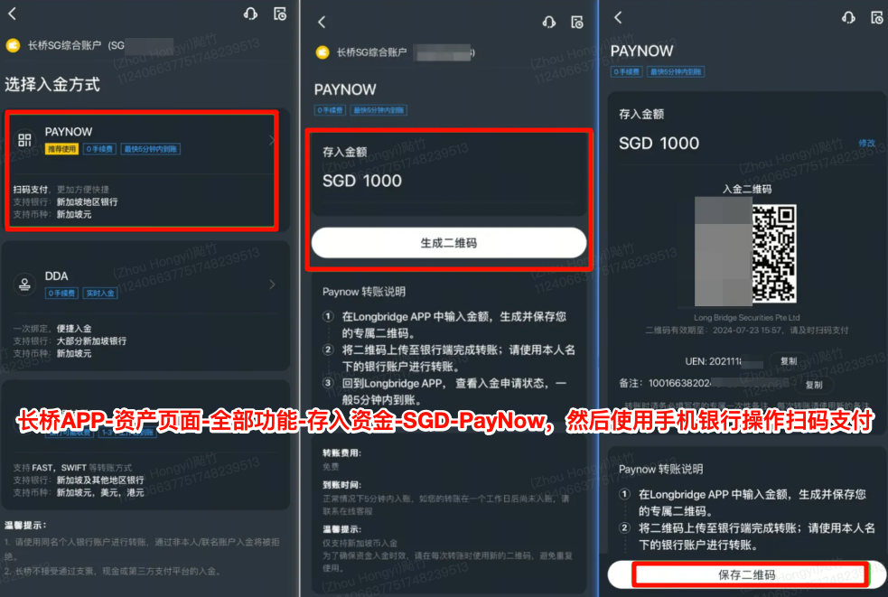

# PayNow 入金

PayNow 是新加坡的实时电子转账服务，支持通过手机号码、身份证/FIN 号码、UEN 或二维码进行即时资金转账。

| 项目 | 说明 |
| --- | --- |
| 支持币种 | 新加坡元（SGD） |
| 预计到账时间 | 实时，最快 5 分钟；扫码时未填备注则需人工匹配，预计 3 个工作日 |
| 手续费 | 免费 |

## 操作步骤

1. 打开长桥 App，进入**资产 → 全部功能 → 存入资金 → SGD → PayNow**，生成收款二维码

PayNow 收款二维码

1. 打开手机银行，扫描二维码，填写备注内容，完成付款

无需上传入金凭证。

## 备注填写要求与同名账户限制

- **必须填写备注**：扫码时未填备注，需人工匹配，预计到账时间延长至 3 个工作日

- 一个二维码只能扫一次；重复扫码不会丢失资金，但需人工匹配

- 如长桥开户名与银行支付名不一致，需人工核实，预计到账时间会延长

- PayNow 不支持出金
