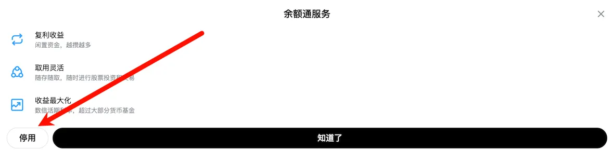

# 余额通

余额通是长桥的闲置资金增值服务，将账户内闲置资金自动投入货币市场基金，获取高于活期存款的收益，同时不影响股票交易。

## 为什么需要余额通

**问题**：当你把钱存在长桥账户里等待交易机会时，这些现金闲置无法获利。银行活期存款利率极低。

**解决方案**：余额通自动将闲置资金投入货币市场基金，利用你的空闲现金获取更高收益——同时保持完全的流动性：你可以随时提取这些资金用于买入股票，无需额外操作。

**核心优势**：

- 收益率**远高于**活期存款（约 3-5% 年化 vs 银行 0.3% 以下） 

- **完全自动**——资金到账即自动转入，无需手动操作 

- **随时可用**——卖出基金立即到账，不阻碍交易

## 新加坡余额通

| 项目 | 说明 |
| --- | --- |
| 支持币种 | 新币（SGD）、美元（USD） |
| 起投金额 | 0.01 |
| 自动转入时间 | 每天 10:00（新加坡时间） |
| 可用操作 | 股票交易、新股认购、换汇、出金（立即可用） |
| 收益周期 | T 日 10:00 前转入 → T+2 日开始计息 → T+3 日首次展示收益 |
| 最晚赎回到账 | T+1 日 |

对接基金：

- 美元：iFAST USD Enhanced Liquidity USD A（基金代码 SGXZ93563658，A 类，2023/6/1 成立于新加坡）

- 新币：iFAST SGD Enhanced Liquidity A SGD Acc（基金代码 SGXZ39518451，A 类，2024/3/13 成立于新加坡）

签署授权后，每天 10:00 自动将闲置资金转入货币基金；买股票、认购新股等扣款时自动赎回。交易日 10:00 前提交手动赎回申请当日处理，晚于 10:00 则 T+3 日内赎回款不会自动转入。赎回的资金最晚 T+1 日到账。

**收益周期具体示例：**

| 转入申请时间 | 确认份额（开始计息） | 首次收益展示日 |
| --- | --- | --- |
| 周一 8:30（10:00 前） | 周二 | 周三 |
| 周一 15:30（10:00 后） | 周三 | 周四 |

## 关闭余额通

关闭后，系统在最近交易日赎回持仓，最晚 T+1 到账。

关闭新加坡余额通操作界面
