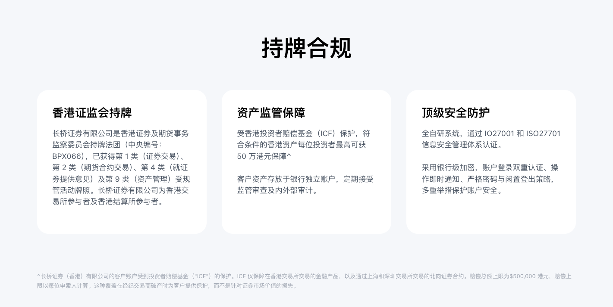

# 长桥证券背景与资质

长桥证券的持牌资质、监管主体及客户资产保障机制。

## 持牌资质

长桥证券（香港）有限公司（中央编号：**BPX066**）持有香港证监会以下牌照：

| 牌照类别 | 业务范围 |
|---------|---------|
| 第 1 类 | 证券交易 |
| 第 2 类 | 期货合约交易 |
| 第 4 类 | 就证券买卖提供意见 |
| 第 9 类 | 提供资产管理 |

资产安全受监管机构定期严格审查及内外部审计。长桥持续进行全球主要金融市场的合规布局，拓展全球市场。

官方网站：[longbridge.com/hk](https://longbridge.com/hk/zh-CN)

## 客户资产保障

长桥证券（香港）有限公司的客户账户受**投资者赔偿基金（ICF）**保护。

**保障范围：**
- 在香港交易所交易的金融产品
- 通过上海和深圳交易所交易的北向证券合约

**赔偿上限：** 每位申索人最高 **500,000 港元**

**适用情形：** 在经纪交易商破产时为客户提供保护，不包括证券市场价值损失。

<!-- backlinks:start -->

## 引用此页面的文档

- [合规与税务](/compliance-and-tax)

<!-- backlinks:end -->
