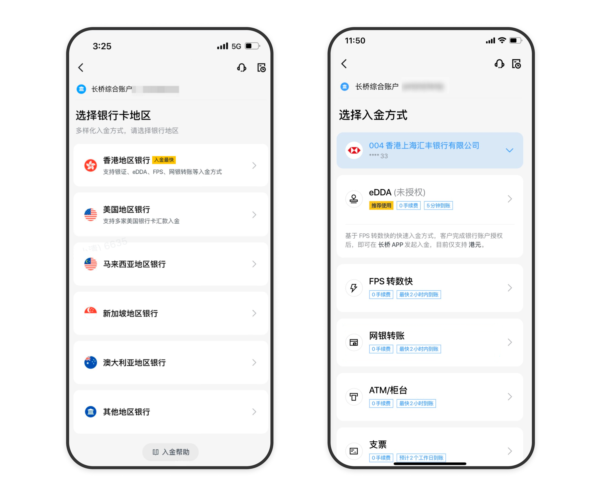
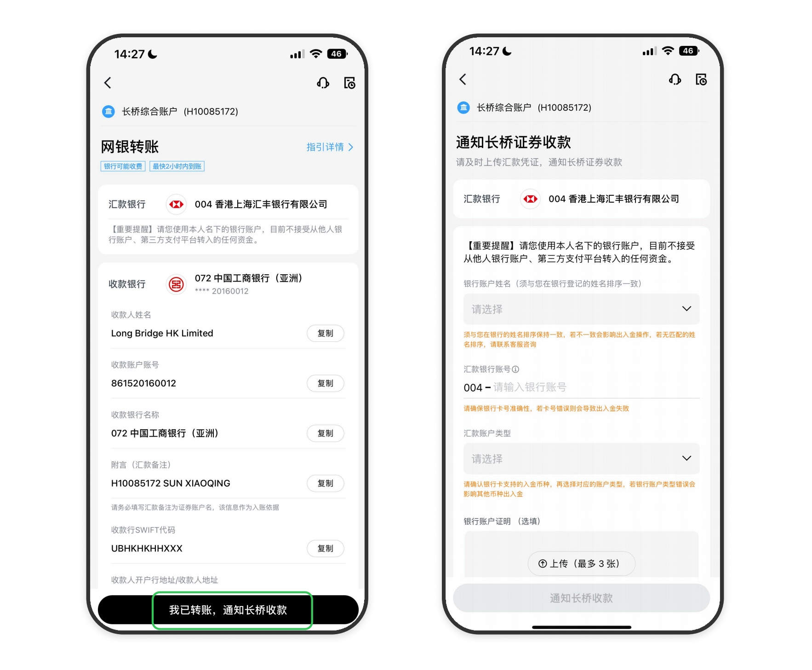
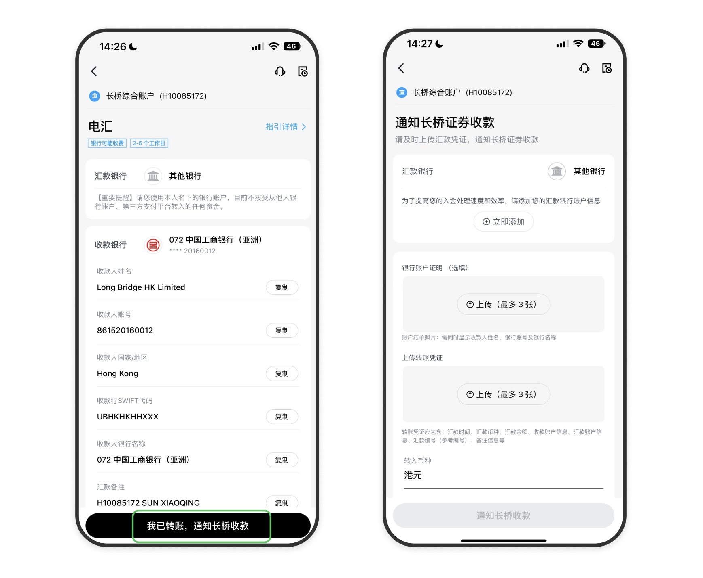

# 入金操作指南

入金需遵循账户名一致性等规则。本页提供完整操作步骤及常见问题解答。

## 支持的入金币种

长桥支持**港元**和**美元**入金。

## 入金门槛

目前没有入金门槛。

> 注：香港线上开户（入金见证）的用户首次入金需不低于 10,000 港元或 1,500 美元才能完成开户。

## 操作步骤

### 香港银行卡入金

**步骤 1**：打开长桥 App → 资产 → 存入资金，选择**入金币种**及**入金银行卡**，查看当前银行卡支持的入金方式。

**步骤 2**：根据不同的入金方式，参考对应入金指引完成汇款。各方式详见[入金方式](/deposit/methods-overview)。

**步骤 3**：完成汇款后，保留汇款凭证，回到长桥 App，填写**汇款通知**，上传汇款凭证。

**步骤 4**：在汇款通知中填写准确的汇款金额，提交即可。

**注意事项：**
- 通过网银转账时，汇款备注须填写**证券账号 + 姓名**
- 汇款完成后请立即截图并通过 App 上传；如无法截图，可用短信通知截图作为凭证

### 非香港银行卡入金（电汇）

**步骤 1**：确认银行卡是否支持入金（仅支持 FATF 成员国家/地区的跨境银行转账）。

**步骤 2**：在 App 入金页面选择入金方式为**电汇** → 上传汇款凭证 → 立即添加。

**步骤 3**：按照[电汇入金指引](/deposit/hk-methods/wire-transfer)完成转账操作。

**步骤 4**：完成汇款后保留汇款凭证，回到长桥 App 填写**汇款通知**（包含汇款凭证和汇款金额）。

**注意事项：**
- 非香港银行卡只支持电汇转账，且仅限 FATF 成员国家/地区
- 请勿使用大陆银行卡或非 FATF 国家银行卡转账，否则资金会被退回且退回手续费由您自行承担
- 通过网银汇款时，汇款备注须填写**证券账号 + 姓名**

---

## 到账延迟、驳回与 eDDA 疑问

### 已经转账了，账户怎么还没到账？

除 eDDA 入金和银证转账外，转账后请在 App → 资产 → 存入资金上传汇款凭证。提交后可在存入资金 → 入金记录中查看详细进度。

### 已提交入金申请了，怎么还没到账？

可在存入资金 → 入金记录中查看进度。不同入金方式到账时间不同，银行和长桥在周末及香港节假日均不处理汇款业务，请预留处理时间。

### 入金失败被驳回了如何处理？

在存入资金 → 入金记录中点击该条记录查看失败原因。如是银行卡信息错误，可在资产 → 银行卡中修改，然后重新提交入金申请。

### 入金手续费怎么收？

银证转账、eDDA、FPS 转数快入金免费；网银、ATM/柜台、支票、电汇可能收取银行手续费（长桥不收费），建议入金前提前咨询银行。

### 需要先绑卡再入金吗？

非香港银行卡建议先绑卡再入金。若先转账后发现银行卡不支持入金，可能导致资金被退回并产生手续费。

### 入金被退回后多久能收到退款？

一般 10-15 个工作日原路退回。若金额有所减少，可能是银行收取的手续费，请联系银行确认。

### 支持 Wise 入金吗？

目前不支持（新加坡账户支持 Wise）。

### eDDA 授权失败如何处理？

常见原因：
- 证件类型、卡号、姓名与 eDDA 授权时填写的信息不一致
- 银行账户名与长桥证券账户名不同名
- 银行未登记有效手机号或电邮
- 汇丰银行需注意储蓄账户（尾数 888/833）与往来账户（尾数 001）的区别

如在 App 内多次失败，可尝试在银行网页端授权。

### eDDA 一直处于授权中怎么处理？

不同银行处理速度不同，汇丰较快，华侨银行等约需 2 个工作日，请耐心等待或咨询银行。

### eDDA 转账不是免费的吗，为什么被收费？

转账手续费本身免费。但若账户余额不足，部分银行（如汇丰）可能扣除手续费，请确保转账前账户余额充足。

---

## 账户同名要求与入金限制

- **账户同名**：转账使用的银行账户名必须与长桥证券账户名一致，不可使用他人账户或联名卡，产生的退款手续费由客户承担
- **到账时间**：银行通知「已汇出」不等于长桥已收到款项，节假日不处理汇款，请预留时间
- **不支持**：大陆内地银行卡入金、现金存入、信用卡入金（将被退回，约 14 个工作日处理）
- **多笔入金**：请针对每笔资金分别填写汇款通知
- **追缴保证金**：因追缴保证金而入金时，请及时填写存款通知，避免平仓

<!-- backlinks:start -->

## 引用此页面的文档

- [入金](/deposit)
- [入金方式](/deposit/methods-overview)

<!-- backlinks:end -->
