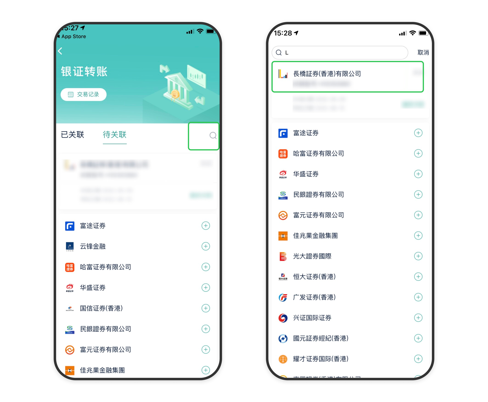
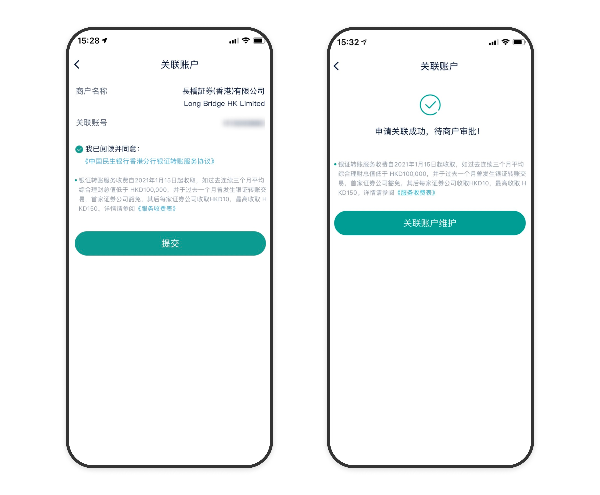
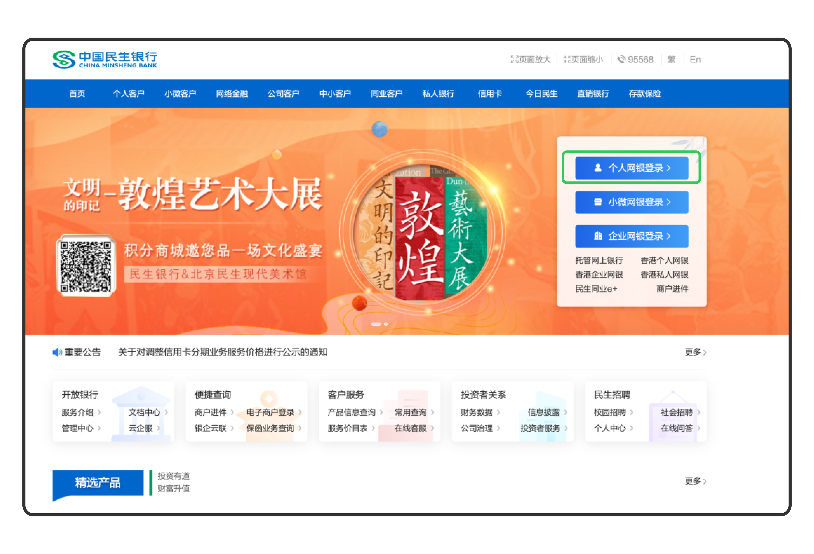
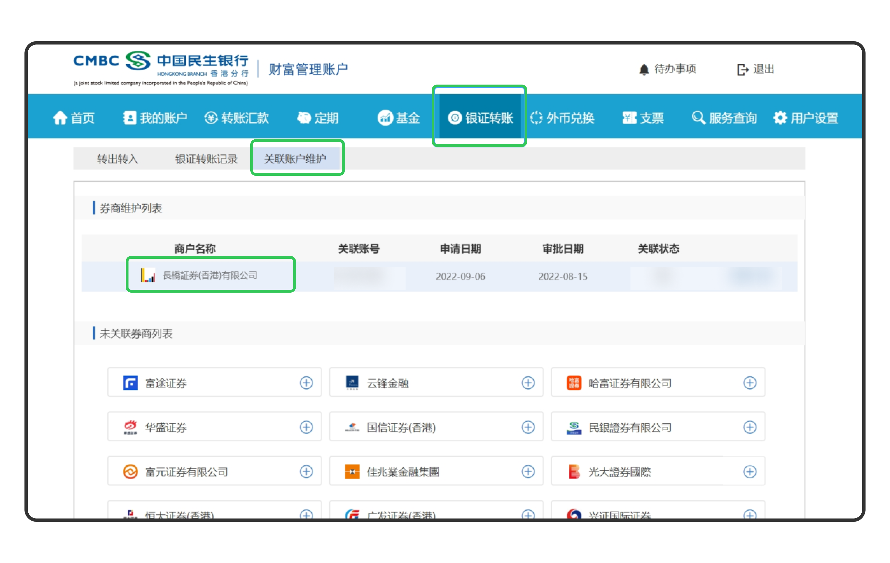
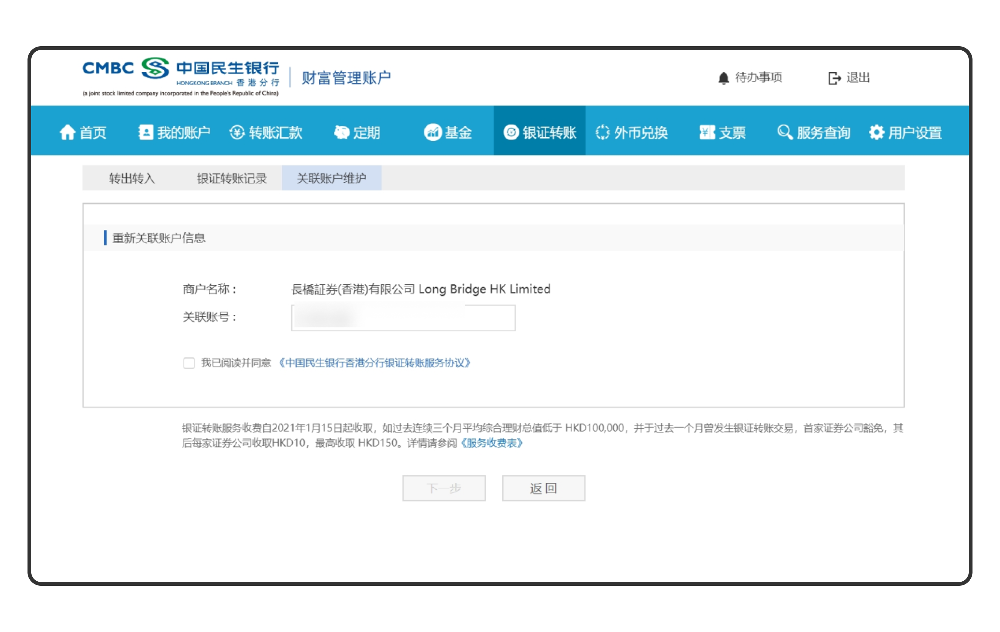
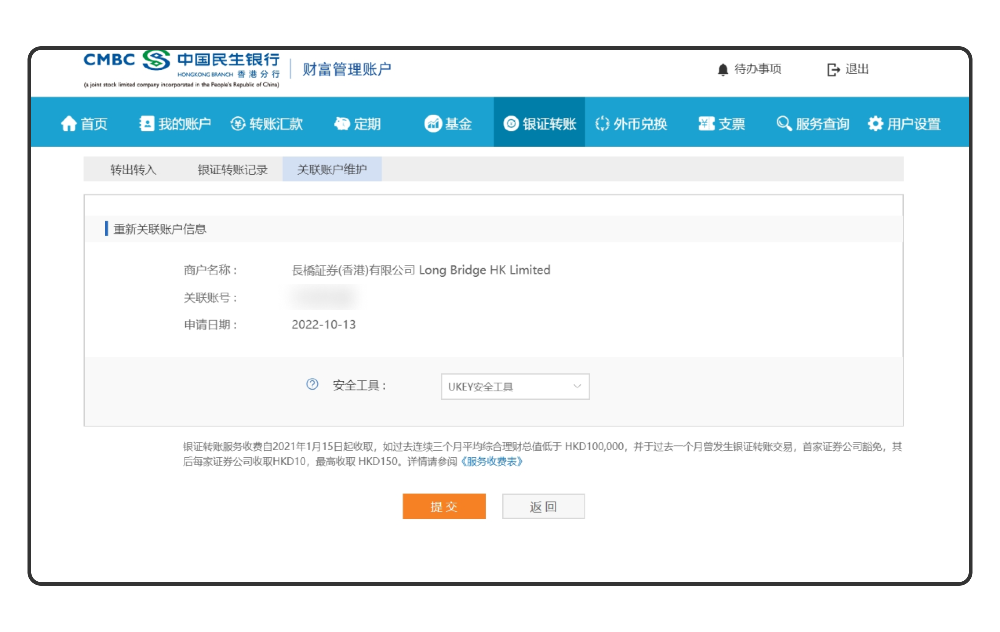
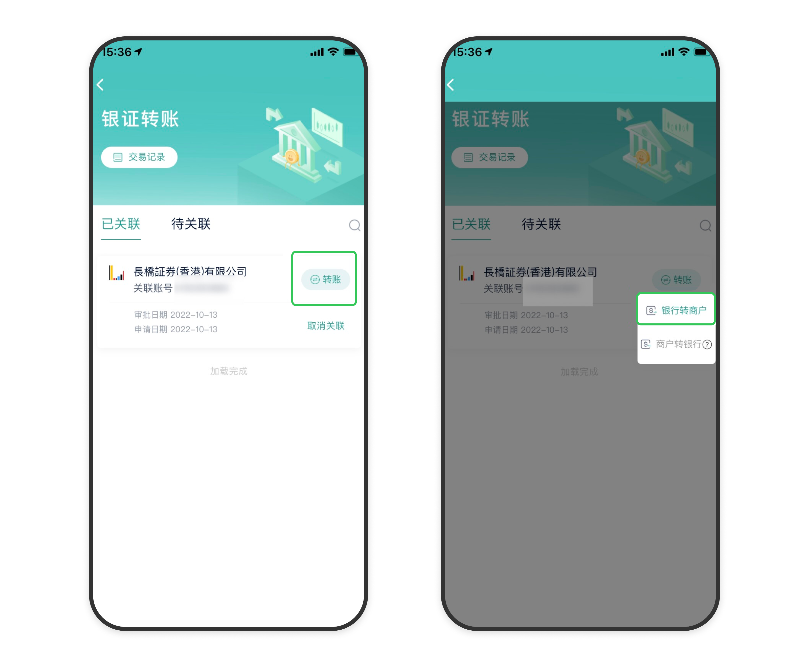
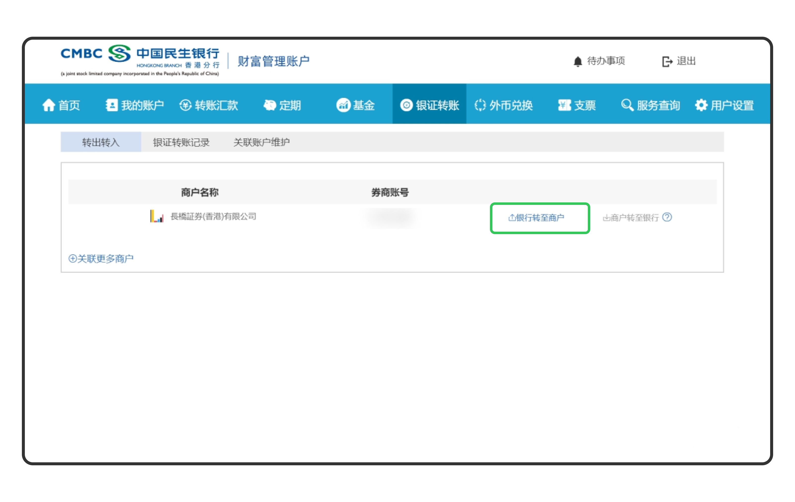
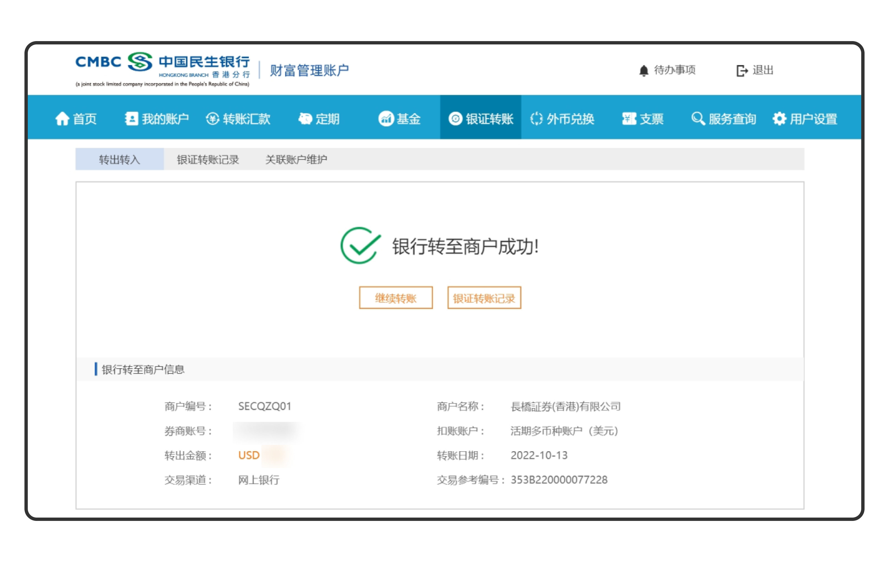

# 银证转账入金

银证转账是银行账户与证券账户之间的资金划转服务，可直接从银行将资金转入长桥证券账户，无需通过网银汇款，无需上传入金凭证。目前仅支持**民生银行（香港）**。

| 项目 | 说明 |
|------|------|
| 支持币种 | 港元（HKD）、美元（USD） |
| 预计到账时间 | 工作日 09:00–15:00 约 5 分钟；其他时段约 1 个交易日 |
| 手续费 | 免费 |

## 第一步：开通银证关联

首次使用需先在民生银行端完成关联开通。

**民生香港 App**

1. 打开民生香港 App → **银证** → 搜索「长桥证券（香港）有限公司」→ 点击「关联」

   

2. 商户名称确认为「Long Bridge HK Limited」，关联账号填写长桥账户号码，点击「提交」

   

3. 提示申请关联成功，等待审核

**民生香港网上银行**

1. 登录民生银行个人网上银行

   

2. 银证转账 → 关联账户维护 → 新增关联账户

   

3. 商户名称选择「长桥证券（香港）有限公司 Long Bridge HK Limited」，关联账号填写长桥综合账户号码（如 H12345678）

   

4. 插入 UKEY 并输入密码完成验证，等待审核

   

## 第二步：发起入金

**民生香港 App**

1. 打开民生香港 App → **银证**
2. 选择已关联的「长桥证券（香港）有限公司」→「转账」→「银行转商户」

   

3. 填写扣款账户和转账金额，确认后提交

**民生香港网上银行**

1. 登录网上银行 → **银证转账 → 转出转入 → 银行转至商户**

   

2. 填写扣款账户和转账金额，确认后提交

   

> 民生网银交易时间：香港工作日 09:00–18:00，非工作时间及周六、周日和香港假期不接受转账。

## 同名账户与民生银行操作要求

- 转账银行账户名必须与长桥证券账户名同名，不可使用他人或联名账户转账
- 需在民生银行登记有效手机号码、电邮地址及最新签发证件
- 银行通知「已汇出」不等于长桥已收款，资金到达后需结算与审批
- 香港公众假期不处理汇款业务，请预留时间
- 不接受直接存入现金

---

## 相关文档

- [入金方式总览](/deposit/methods-overview) — 对比所有入金方式的预计到账时间与手续费
- [入金未到账排查](/troubleshooting/deposit-not-received) — 超出预期时间未到账时的排查步骤

<!-- backlinks:start -->

## 引用此页面的文档

- [如何选择入金方式](/deposit/how-to-choose-deposit-method)
- [入金](/deposit)

<!-- backlinks:end -->
