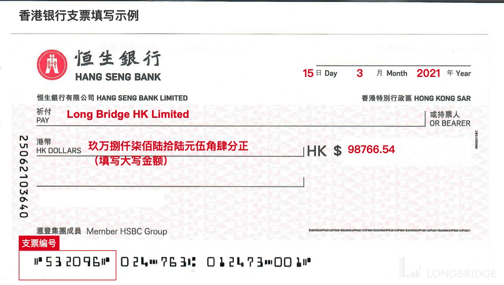
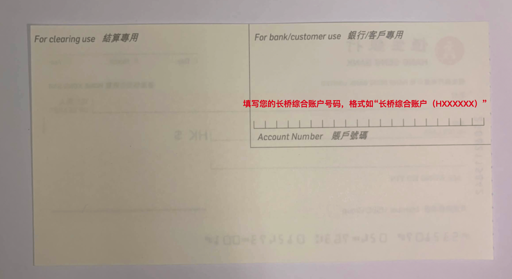
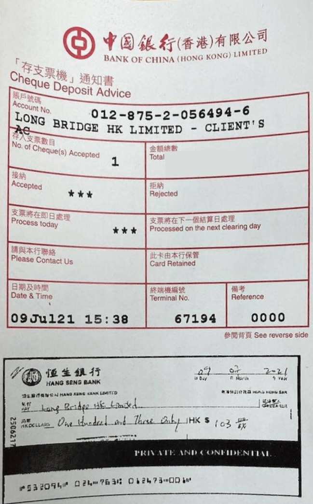
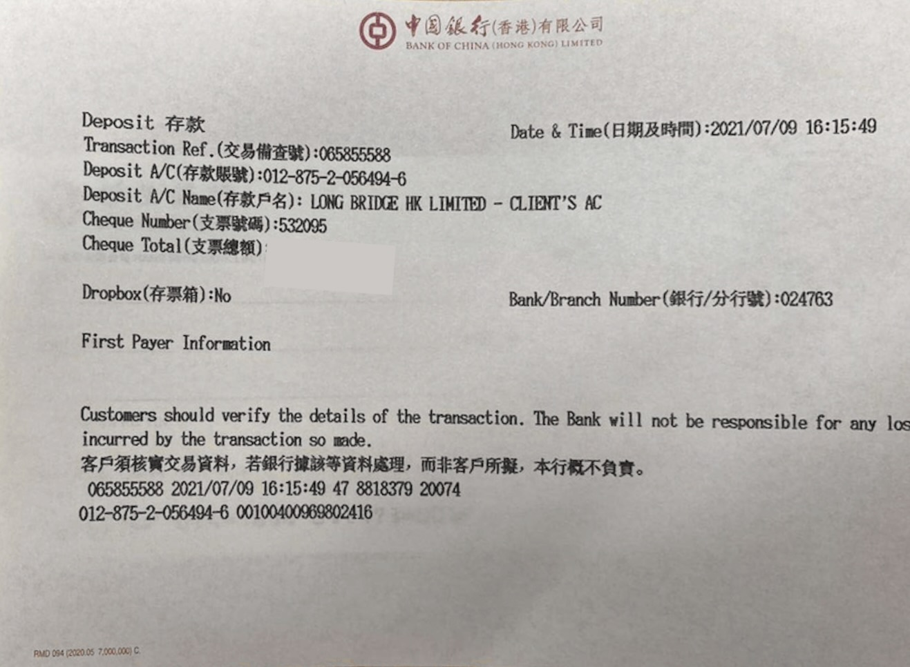

# 支票入金

通过香港银行支票将资金转账至长桥收款账户，转账完成后需上传支票及汇款凭证。

| 项目 | 说明 |
|------|------|
| 支持币种 | 港元（HKD）、美元（USD） |
| 预计到账时间 | 约 2 个工作日 |
| 手续费 | 长桥免费，具体费用以银行实际收取为准 |

## 收款银行信息

- 收款人名称：Long Bridge HK Limited
- 港元收款账号：01287520564946
- 美元收款账号：01287520564962
- 收款银行（中文）：中国银行（香港）有限公司（银行编号：012）
- 收款银行（英文）：Bank of China (Hong Kong) Limited
- SWIFT 代码：BKCHHKHHXXX
- 银行地址：83 Des Voeux Road Central, Hong Kong
- 递交方式：将支票递交至银行柜台或存支票机

## 操作步骤

1. 填写支票：正面收款人填写 **Long Bridge HK Limited**；反面填写**长桥综合账户 + 你的账户号码**（如「长桥综合账户（H10057829）」），并拍摄正反面照片

   支票正面示例：
   

   支票反面示例：
   

2. 将支票递交至银行柜台或存支票机，保留转账凭证截图

   存支票机转账凭证示例：
   

   柜台转账凭证示例：
   

3. 打开长桥 App，进入**资产 → 存入资金 → 支票转账**，上传支票正面、反面截图和转账凭证

> 完成后请立即上传所有凭证，否则影响入金进度。

## 支票类型与限制

- 仅支持香港银行支票，不支持香港银行本票
- 不建议支票转至工银亚洲收款账户（核对资料需额外时间，资金入账速度较慢）
- 转账银行账户名必须与证券账户名同名，不可使用他人账户，否则产生的退款费用由客户自身承担
- 银行间后台处理汇款申请需要一定时间，银行通知「已汇出」不等于长桥证券已收到款项；资金到达长桥证券后需进行结算与审批
- 银行和长桥证券在香港公众假期均不处理汇款业务，请预留好汇款处理时间
- 不接受直接存入现金

## 出金

长桥不支持通过支票办理出金。

---

## 相关文档

- [入金方式总览](/deposit/methods-overview) — 对比所有入金方式的预计到账时间与手续费
- [入金未到账排查](/troubleshooting/deposit-not-received) — 超出预期时间未到账时的排查步骤

<!-- backlinks:start -->

## 引用此页面的文档

- [入金](/deposit)
- [入金方式](/deposit/methods-overview)

<!-- backlinks:end -->
