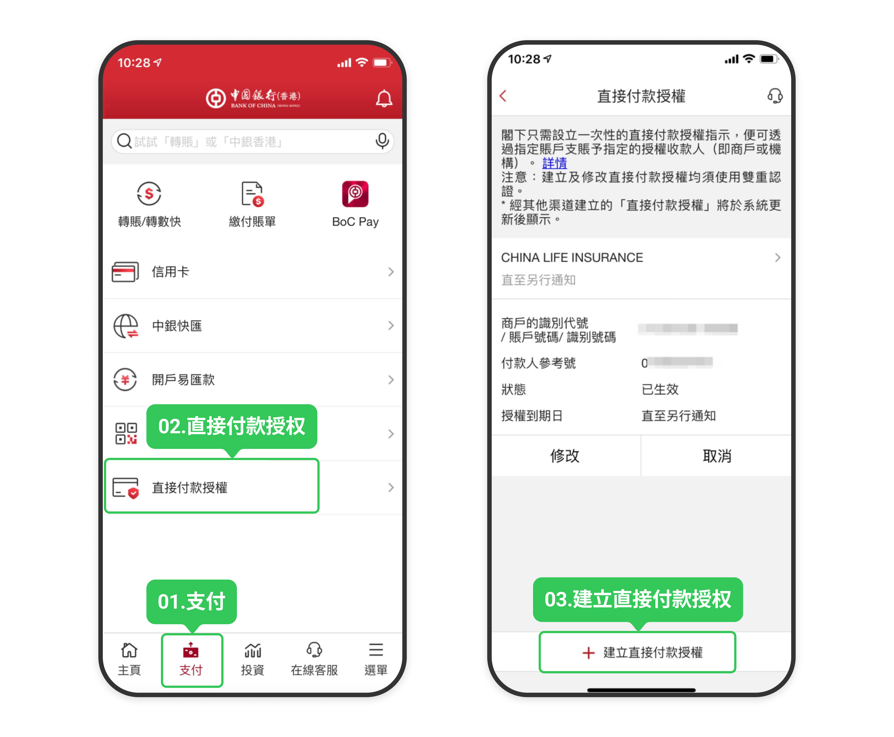
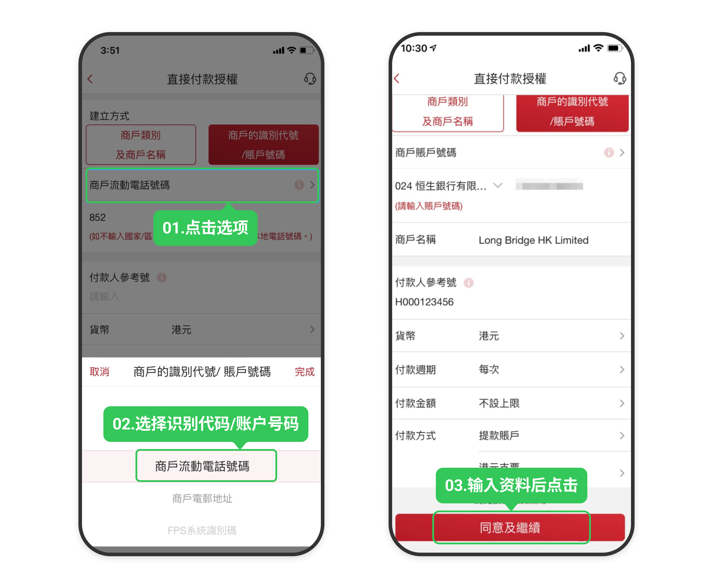
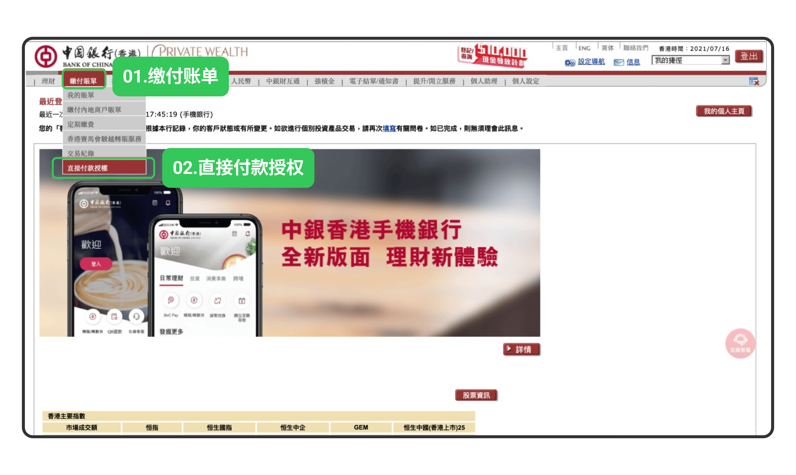
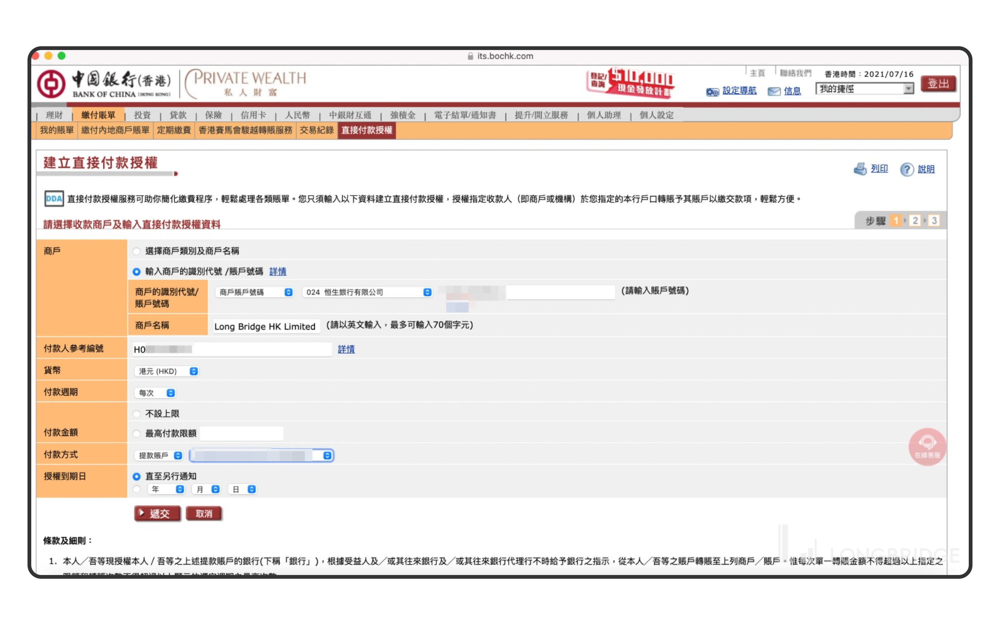
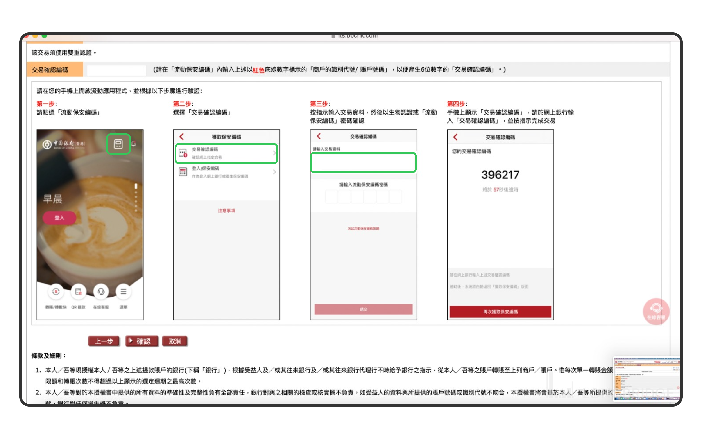

# 中银香港 eDDA

中银香港（BOC HK）的 eDDA 授权需在银行端操作，支持手机银行和网上银行两种方式。完成授权后再在长桥 App 发起入金，无需每次上传凭证。

> eDDA 入金的到账时间、手续费及通用故障排查，见 [eDDA 入金](/deposit/hk-methods/edda)。

## 第一步：完成银行端授权

### 手机银行

1. 打开**中国银行手机 App** → **支付** → **直接付款授权** → **建立直接付款授权**

   

2. 选择商户的识别代码／账户号码，填写以下信息后点击**同意及继续**：

   | 字段 | 填写内容 |
   |------|---------|
   | 账户号码 | 选择「024 恒生银行有限公司」，输入「752 027854 001」 |
   | 商户名称 | Long Bridge HK Limited |
   | 付款人参考号 | 长桥账号（即长桥 App 授权指引页面中的「付款人编号」） |
   | 货币 | 港元 |
   | 付款周期 | 每次 |
   | 付款金额 | 按需填写，建议不设上限 |

   

3. 确认资料无误，输入网上银行密码或 Face ID 完成认证

### 网上银行

1. 登入**中国银行（香港）网上银行** → **缴付账单** → **直接付款授权**

   

2. 建立**直接付款授权**，填写以下信息：

   | 字段 | 填写内容 |
   |------|---------|
   | 账户号码 | 选择「024 恒生银行有限公司」，输入「752027854001」 |
   | 商户名称 | Long Bridge HK Limited |
   | 付款人参考号 | 长桥账号（即长桥 App 授权指引页面中的「付款人编号」） |
   | 货币 | 港元 |
   | 付款周期 | 每次 |
   | 付款金额 | 按需填写，建议不设上限 |
   | 付款方式 | 提款账户（选择自己的付款账户） |
   | 授权到期日 | 直至另行通知 |

   

3. 核对信息无误，按银行指引获取保安编码，输入**交易确认编码**，点击**确认**

   

## 第二步：长桥 App 发起入金

提交授权后，等待银行和长桥审批（预计 1–2 个银行工作日生效）。授权成功以银行端通知为准。

授权生效后：长桥 App → **资产** → **存入资金** → **存入港元**，选择中银香港银行卡，点击「立即入金」。

<!-- backlinks:start -->

## 引用此页面的文档

- [eDDA 入金](/deposit/hk-methods/edda)

<!-- backlinks:end -->
