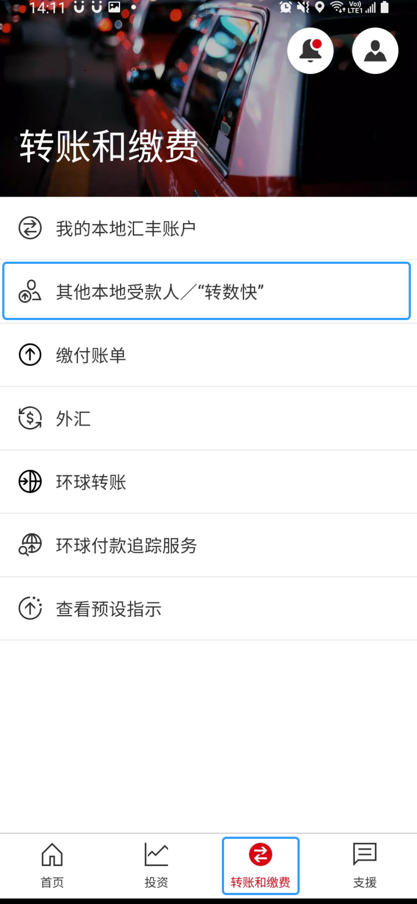
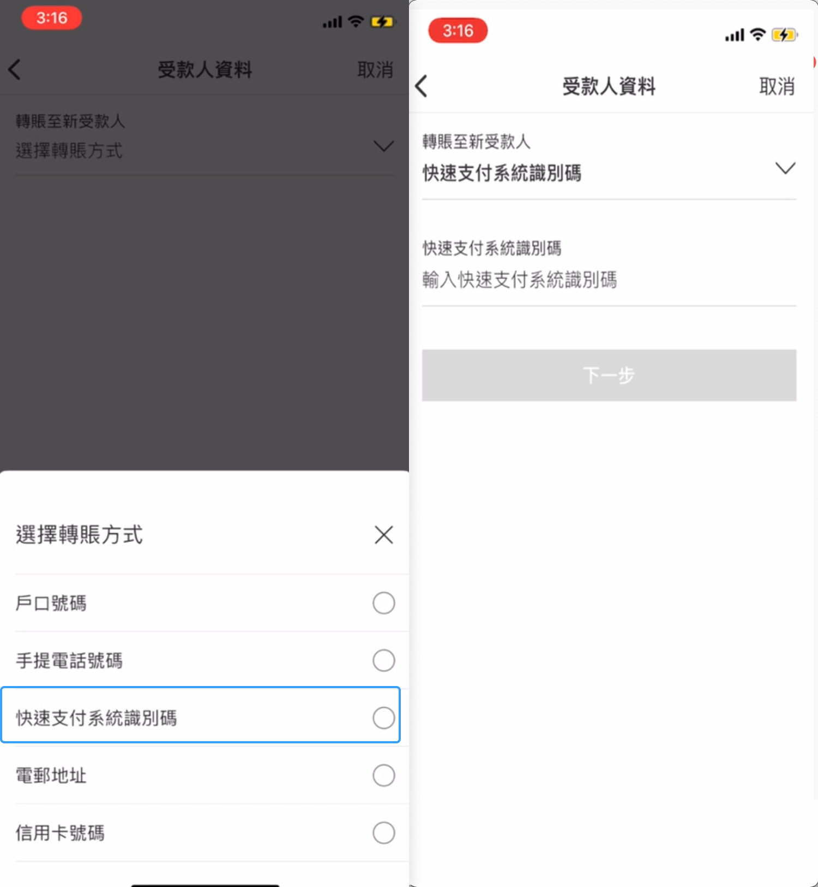

# 汇丰 FPS 转数快

通过汇丰银行 App 的 FPS 功能将资金转至长桥，转账完成后上传凭证即可。

> FPS 入金的到账时间、手续费及通用注意事项，见 [FPS 转数快入金](/deposit/hk-methods/fps)。

## 操作步骤

1. 打开**长桥 App** → **资产** → **存入资金** → **FPS 转数快**，复制 FPS ID

   | 长桥 FPS ID | 169152691 |
   |------------|-----------|
   | 收款银行 | 中国工商银行（亚洲） |
   | 收款人名称 | LONG BRIDGE HK LIMITED-CLIENT'S A/C |

   

2. 打开**汇丰银行 App** → **转账/转数快** → **其他本地受款人 / "转数快"**

   

3. 选择**汇款银行账户**，点击勾选

   

4. 点击**转账至新受款人** → **选择转账方式**，在下拉弹框中选择**快速支付系统识别码**，填写 FPS ID

   

5. 输入存入资金金额，点击**继续**，核对信息后**提交**

   

6. 提示「已提交」即表示转账完成

7. 立即返回**长桥 App** → **资产** → **存入资金** → **FPS 转数快**，上传汇款凭证

   

   > 凭证必须在转账后立即上传，否则影响入金进度。

<!-- backlinks:start -->

## 引用此页面的文档

- [FPS 转数快入金](/deposit/hk-methods/fps)

<!-- backlinks:end -->
