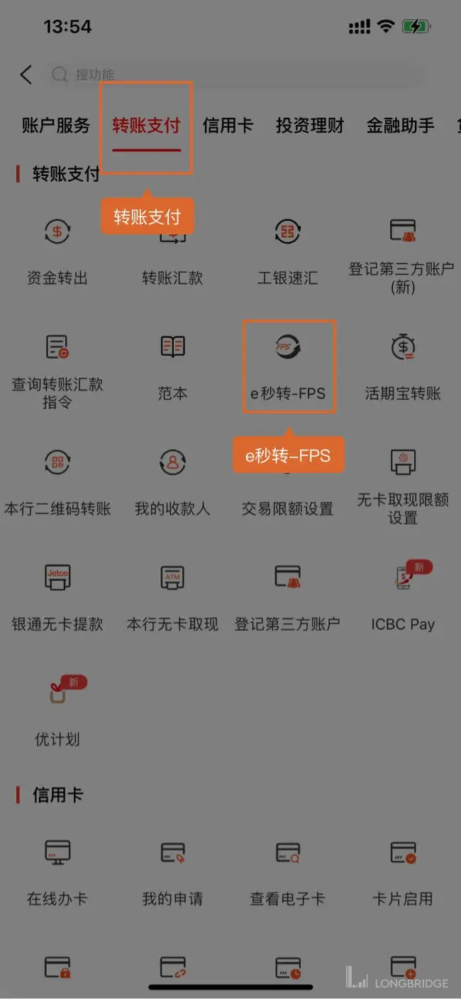
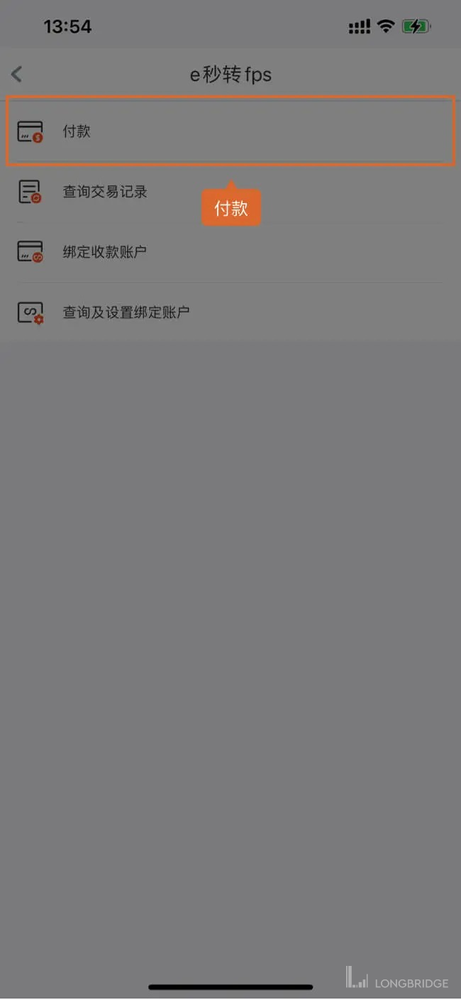
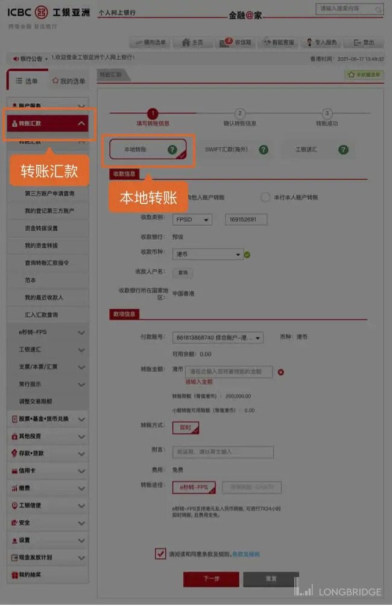
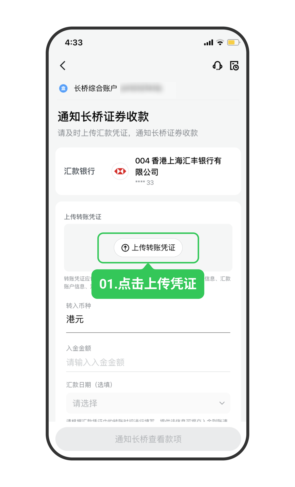

# 工银亚洲 FPS 转数快

通过工银亚洲 App 或网上银行的 FPS 功能将资金转至长桥，转账完成后上传凭证即可。

> FPS 入金的到账时间、手续费及通用注意事项，见 [FPS 转数快入金](/deposit/hk-methods/fps)。

## 工银亚洲账号说明

工银亚洲采用综合账户体系，**账号尾数代表子账户类型**。绑卡时须填写分币种子账户账号（非综合账户）：

> **长桥不支持绑定以「0」结尾的综合账户**，请使用以下尾数的子账户：

| 尾数 | 子账户类型 |
|------|-----------|
| 1 | 港元往来账户 |
| 2 | 港元储蓄账户 |
| 3 | 多种货币储蓄账户 |
| 4 | 定期储蓄账户 |
| 5 | 美元往来账户 |
| 6 | 人民币往来账户 |
| 7 | 人民币储蓄账户 |
| 8 | 港元存折储蓄账户 |
| 9 | 港元往来账户 |

绑卡时还须正确填写**银行账户类型**：港元入金选「港元账户」，美元入金选「美元账户」，否则会影响后续出金。

## 操作步骤

1. 打开**长桥 App** → **资产** → **存入资金** → **FPS 转数快**，复制 FPS ID

   | 长桥 FPS ID | 169152691 |
   |------------|-----------|
   | 收款银行 | 中国工商银行（亚洲） |
   | 收款人名称 | LONG BRIDGE HK LIMITED-CLIENT'S A/C |

   

2. 在工银亚洲发起转账（选择其中一种方式）：

   **方式一：工银亚洲 App**

   打开**工银亚洲 App** → **全部** → **转账支付** → **e 秒转-FPS** → **付款**，填写扣款账户和转账金额，确认后完成转账

   

   

   **方式二：网上银行**

   登入网上银行 → **账户服务** → **转账汇款** → **本地转账**，填写转账信息后提交

   

3. 转账完成后，立即返回**长桥 App** → **资产** → **存入资金** → **FPS 转数快**，上传汇款转账凭证

   

   > 凭证必须在转账后立即上传，否则影响入金进度。

<!-- backlinks:start -->

## 引用此页面的文档

- [FPS 转数快入金](/deposit/hk-methods/fps)

<!-- backlinks:end -->
