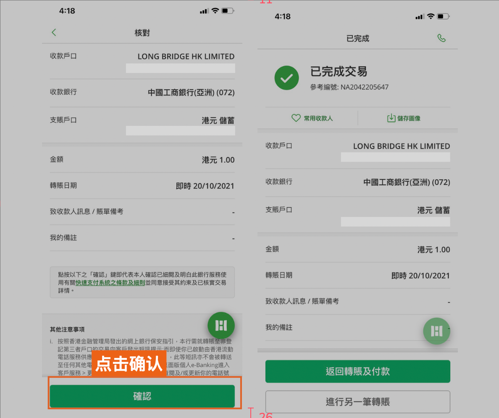
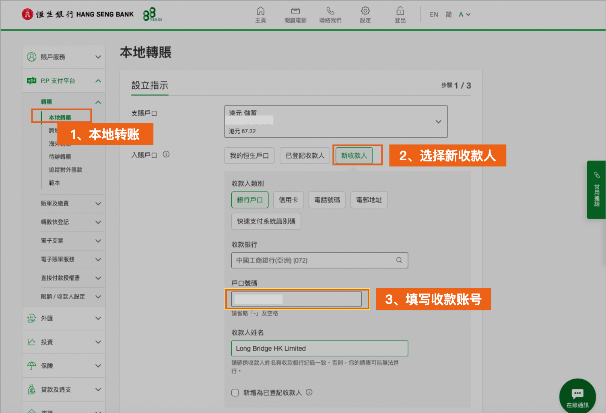
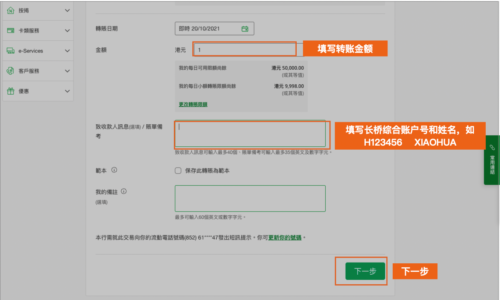
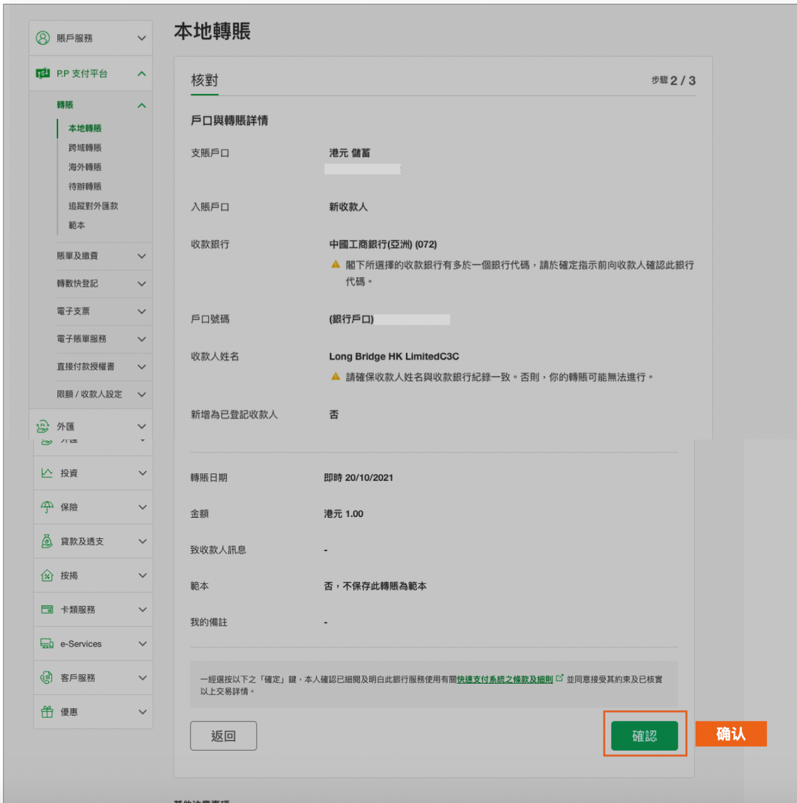
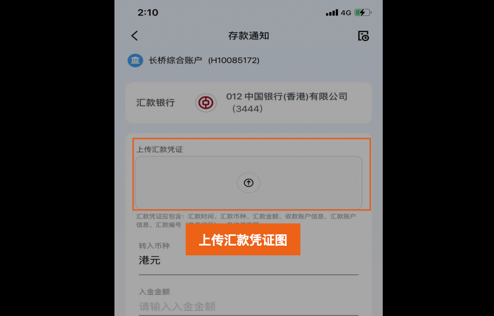

# 恒生银行网银转账

通过恒生银行手机银行或网上银行将资金转至长桥，转账完成后上传凭证即可。

> 网银转账的到账时间、手续费及通用注意事项，见 [网银转账入金](/deposit/hk-methods/online-banking-transfer)。

## 收款账户信息

**港元（工银亚洲 072）**

| 字段 | 内容 |
|------|------|
| 收款人名称 | Long Bridge HK Limited |
| 港元收款账号 | 861520160012 |
| 收款银行 | 中国工商银行（亚洲）有限公司 |
| 银行编号 | 072 |
| SWIFT 代码 | UBHKHKHHXXX |
| 银行地址 | 33/F, ICBC Tower, 3 Garden Road, Central, Hong Kong |

**美元（创兴银行 041）**

| 字段 | 内容 |
|------|------|
| 收款人名称 | Long Bridge HK Limited |
| 美元收款账号 | 256150608546 |
| 收款银行 | 创兴银行有限公司 |
| 银行编号 | 041 |
| SWIFT 代码 | LCHBHKHH |
| 银行地址 | Chong Hing Bank Centre, 24 Des Voeux Rd. Central, Hong Kong |

## 手机银行

1. 打开**恒生银行 App** → **转账及付款** → **转账**
2. 输入长桥收款人名称和收款账号
3. 核对信息无误，确认提交，完成转账

   

4. 立即截图保留凭证，返回**长桥 App** → **资产** → **存入资金** → **网银转账**，上传凭证

## 网上银行

1. 登录**恒生银行网上银行** → **转账** → **本地转账** → **新收款人**，输入长桥收款银行账号信息

   

2. 输入转账金额，在**备注**栏填写长桥综合账户号和姓名（如：H123456 XIAOHUA），点击**提交**

   > 填写备注有助于长桥快速匹配入账。

   

3. 核对所有资料，点击**确认**，转账完成

   

4. 立即截图保留凭证，返回**长桥 App** → **资产** → **存入资金** → **网银转账**，上传凭证

   

   > 凭证必须在汇款完成后立即上传，否则影响入金进度。

<!-- backlinks:start -->

## 引用此页面的文档

- [网银转账入金](/deposit/hk-methods/online-banking-transfer)

<!-- backlinks:end -->
