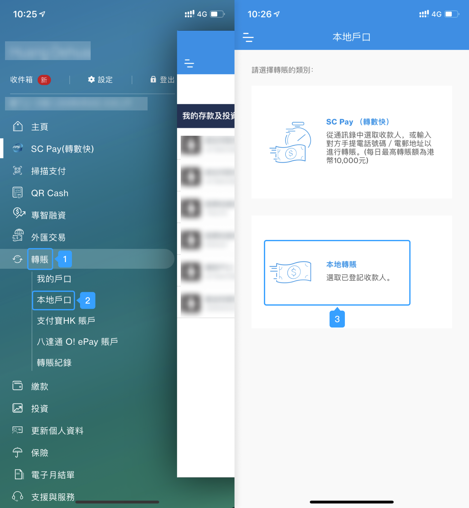
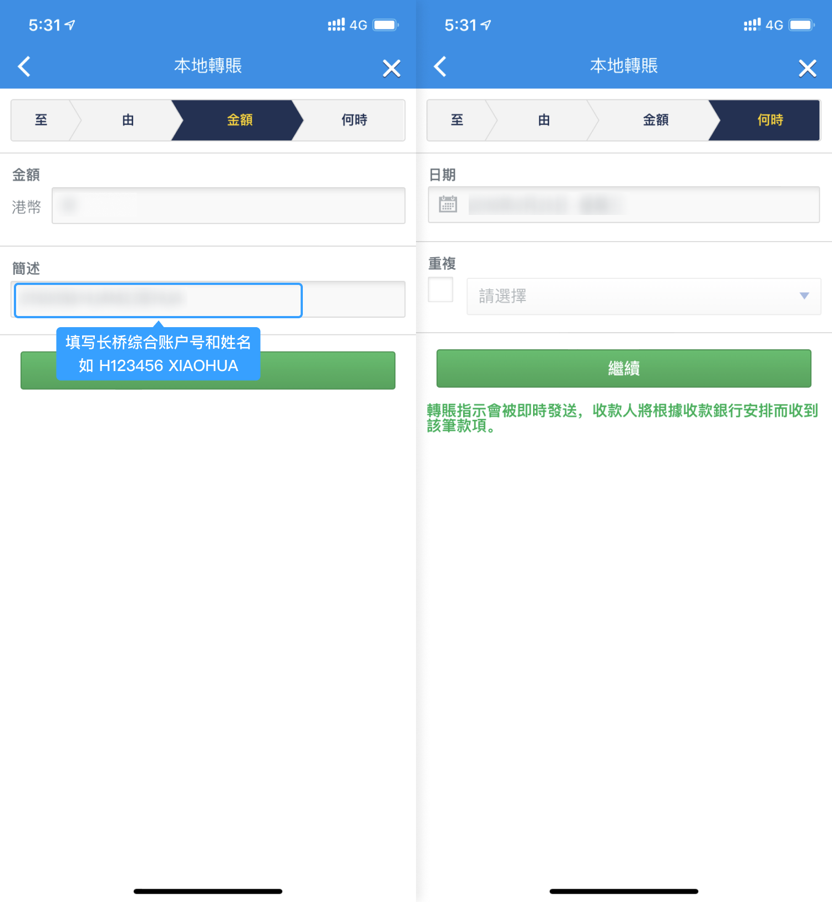
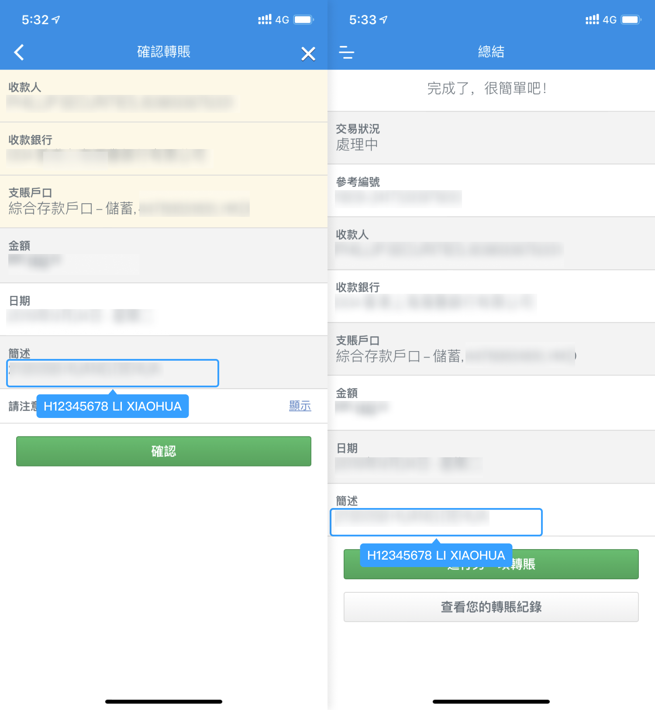
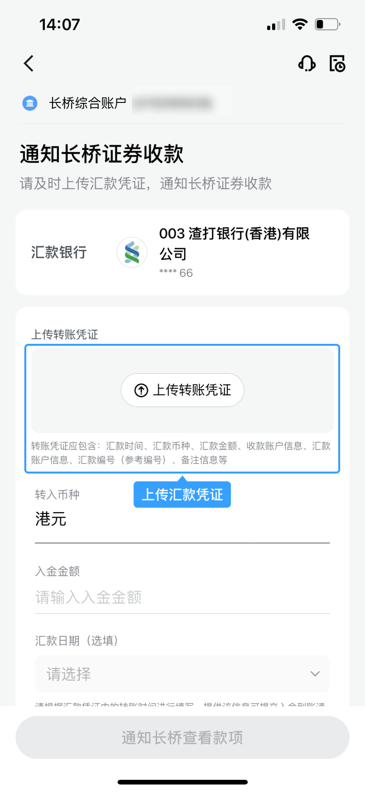
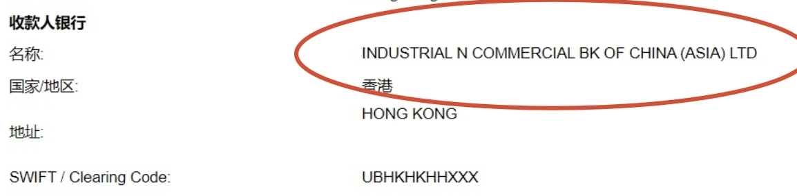
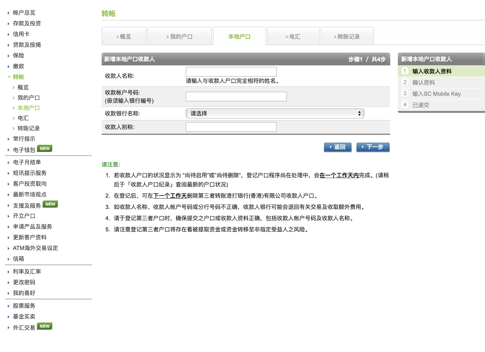
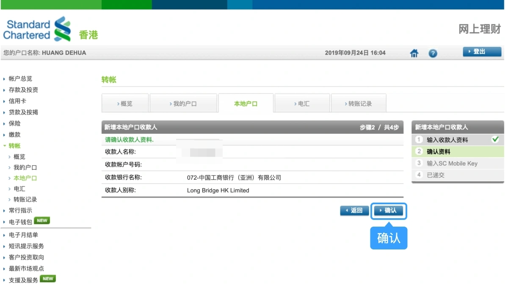
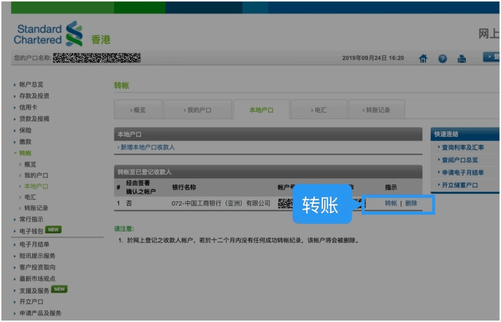

# 渣打银行网银转账

通过渣打银行手机银行或网上银行将资金转至长桥，转账完成后上传凭证即可。

> **重要**：渣打银行港元和美元走不同转账路径：
> - **港元**：使用「转账 - 本地户口转账」（手机 App 和网页端均可）
> - **美元**：使用「转账 - 电汇」（建议网页端操作）
>
> 网银转账的到账时间、手续费及通用注意事项，见 [网银转账入金](/deposit/hk-methods/online-banking-transfer)。

## 收款账户信息

**港元（工银亚洲 072）**

| 字段 | 内容 |
|------|------|
| 收款人名称 | Long Bridge HK Limited |
| 港元收款账号 | 861520160012 |
| 收款银行 | 中国工商银行（亚洲）有限公司 |
| 银行编号 | 072 |
| SWIFT 代码 | UBHKHKHHXXX |
| 银行地址 | 33/F, ICBC Tower, 3 Garden Road, Central, Hong Kong |

**美元（创兴银行 041）**

| 字段 | 内容 |
|------|------|
| 收款人名称 | Long Bridge HK Limited |
| 美元收款账号 | 256150608546 |
| 收款银行 | 创兴银行有限公司 |
| 银行编号 | 041 |
| SWIFT 代码 | LCHBHKHH |
| 银行地址 | Chong Hing Bank Centre, 24 Des Voeux Rd. Central, Hong Kong |

## 手机银行（仅支持港元）

> **前置条件**：首次在手机 App 转账前，必须先登入 PC 网银添加收款人（见下方「网上银行」步骤 1–3）。已添加过的可跳过。

1. 打开**渣打银行 App** → **转账** → **本地户口** → **本地转账**

   

2. 选择已添加的收款人，选择付款方账户

   

3. 输入转账金额和汇款备注，选择预期汇款时间

   

4. 再次核对信息，无误后提交

   > 渣打手机端转账**无须安全验证**，请务必仔细核对后再提交。

   

5. 立即截图保留凭证，返回**长桥 App** → **资产** → **存入资金** → **网银转账**，上传凭证

   

## 网上银行（港元和美元）

1. 登入**渣打银行香港网上理财**（https://www.sc.com/hk/zh），完成安全验证

   

2. 添加收款人（根据入金币种选择不同路径）：

   **港元** → **转账** → **本地户口** → **新增本地户口收款人**

   

   **美元** → **转账** → **本地汇款** → **新增电汇收款人**

   

   > 添加美元电汇收款人时，收款银行选择「Industrial and Commercial Bank of China (Asia) Limited」（可选简写），SWIFT Code：UBHKHKHHXXX。

   

3. 填写收款人资料，点击**下一步**，确认无误后点击**确认**

   

   

4. 按三步输入 **SC Mobile Key** 完成验证，收款人资料添加完毕

   

5. 选择**转账** → **本地户口**，选择收款人，点击**转账**

   

6. 选择支账账户，输入转账金额和汇款备注（填写长桥账号和姓名，如：`H123456, XIAOHUA`），点击**下一步**

   

7. 核对信息无误后点击**确认**，提示成功即转账完毕

8. 立即截图保留凭证，返回**长桥 App** → **资产** → **存入资金** → **网银转账**，上传凭证

   > 凭证必须在汇款完成后立即上传，否则影响入金进度。

<!-- backlinks:start -->

## 引用此页面的文档

- [网银转账入金](/deposit/hk-methods/online-banking-transfer)

<!-- backlinks:end -->
