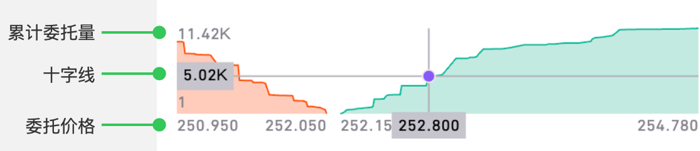
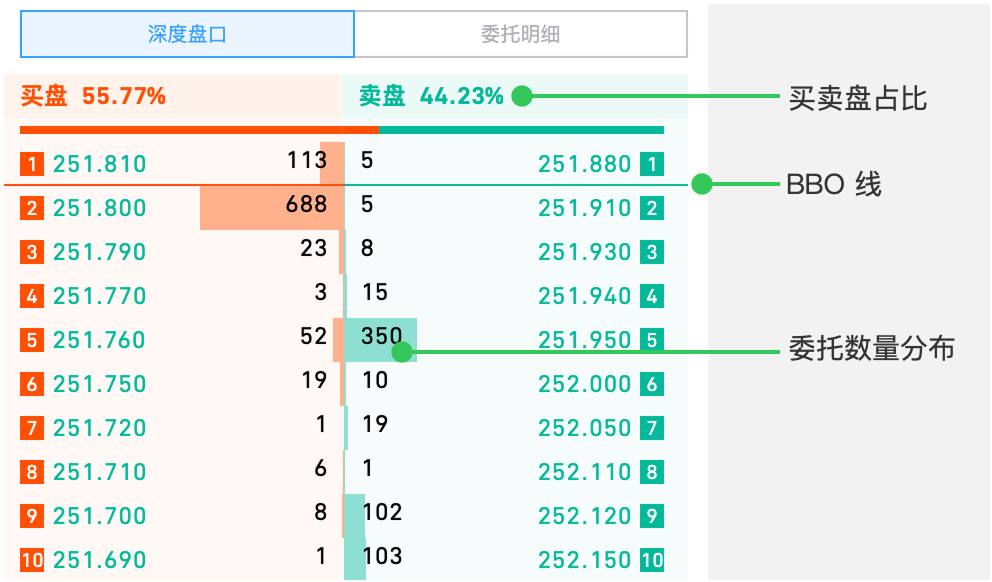
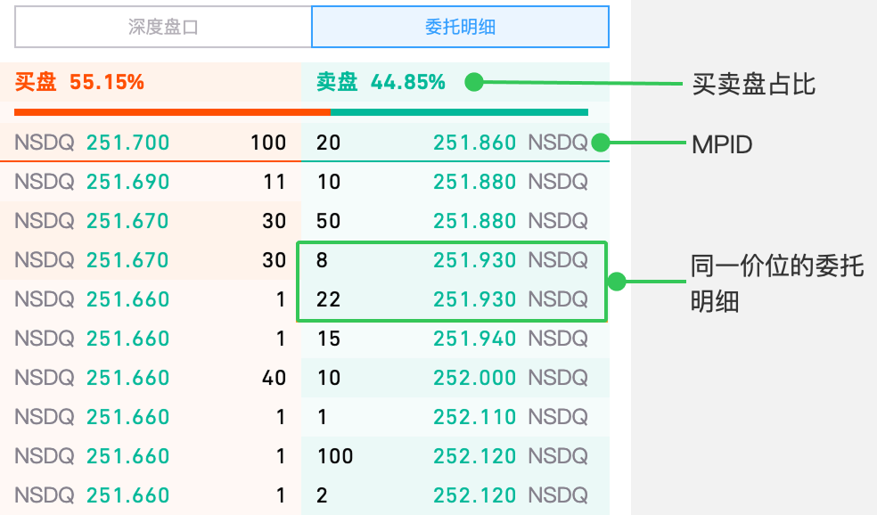
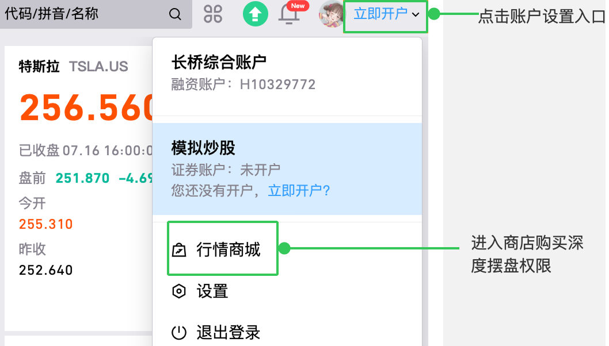
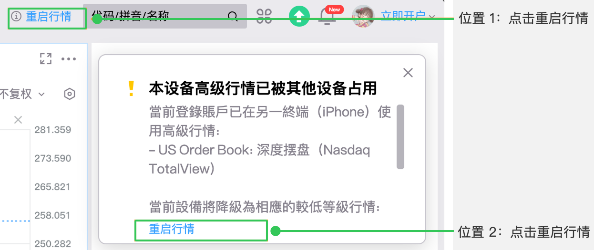

# 美股深度摆盘（桌面端）

美股深度摆盘功能通过深度图、深度盘口和委托明细展示市场多档位买卖盘信息，帮助投资者分析不同价格水平的委托量分布、买卖力量对比及市场流动性特征，支持按需切换报价档位及查看详细订单来源。

## 功能介绍

### 深度图

深度图展示不同价格水平上的买卖订单数量，根据最高 60 档买卖盘价格绘制，不随档位切换而变化。

- **横坐标**：显示委托价格，从左到右依次为：60 档买盘最低价、60 档买盘最高价（买一价）、60 档卖盘最低价（卖一价）、60 档卖盘最高价
- **纵坐标**：显示累计委托量（达到该价位需消化的订单量）。底部数值为买一量与卖一量中的较小值，顶部数值为 60 档买量之和与卖量之和中的较大值
- **十字线**：在深度图区域长按显示十字线，自动吸附图线，滑动时显示当前价位及对应累计委托量

通过深度图可直观看到买卖单数量分布：
- **宽度**：体现委托价格的分散程度
- **高度**：体现买盘和卖盘的总委托量趋势
- **坡度**：体现委托相对集中的价位及对应的委托量

### 深度盘口

提供详细买卖盘报价，涵盖最高 60 档价位信息，支持切换查看 1 档、5 档、10 档、20 档、40 档或 60 档不同深度。

**买卖盘占比**

- 买盘占比：该标的在纳斯达克交易所的「总委买量」占「总委托量」的比例
- 卖盘占比：该标的在纳斯达克交易所的「总委卖量」占「总委托量」的比例

> 买卖盘占比反映的是该标的在交易所的全部委托量分布，不仅限于前 60 档。

**BBO 线**

标识深度摆盘上处于最优买卖一档报价（BBO）价差内的订单：
- 买盘侧：价格高于或等于最优买价的订单，位于买盘 BBO 线上方
- 卖盘侧：价格低于或等于最优卖价的订单，位于卖盘 BBO 线上方

| BBO 类型 | 说明 |
|---------|------|
| 纳斯达克最优报价（NSDQ BBO） | Totalview 和 NSDQ BBO 均来自纳斯达克交易所，因此 Totalview 中的买卖一档与 NSDQ BBO 相同 |
| 全美 17 家交易所的最优报价（National BBO） | National BBO 是全美 17 家交易所的最优报价，碎股委托不计入。因此当行情等级为全美综合行情时，Totalview 深度盘口上的 BBO 线可能跨越多个报价档位 |

**委托数量分布**

通过横向条形图直观呈现委托数量分布。条形图面积以各档位中的最大委托量为基准（设为 100% 长度），其余档位依比例显示。

> 行情页面取选定档位内的最大委托量为基准，全屏页面则取 60 档的最大委托量为基准。

### 委托明细

详尽展示每一档位下所有委托订单的明细。

- **MPID**（Market Participants ID）：市场参与者 ID。若未提供 MPID，盘前/盘中/盘后默认显示 NSDQ（来自纳斯达克交易所），夜盘默认显示 BLUE（来自 Blue Ocean 交易所）
- 买卖盘占比及 BBO 线规则遵循深度盘口标准

---

## 深度摆盘与 BBO 的差异

| 行情功能 | NSDQ BBO | National BBO | Order Book |
|---------|---------|-------------|-----------|
| 行情描述 | 纳斯达克最优报价 | 全美 17 家交易所中的最优报价 | 60 档深度摆盘 |
| 行情等级 | Level 1 | Level 1 | Level 2 |
| 交易所 | 纳斯达克 | 全美 17 家交易所 | 纳斯达克、Blue Ocean |
| 盘口数据 | 买卖 1 档 | 买卖 1 档 | 买卖 60 档 |
| 委托明细 | 无 | 无 | 有 |
| 深度图 | 无 | 无 | 有 |

---

## 深度摆盘数据时段与权限获取

### 在哪些交易时段提供深度摆盘数据？

| 市场时段 | 深度摆盘数据 |
|---------|------------|
| 盘前交易时段 | Nasdaq TotalView |
| 盘中交易时段 | Nasdaq TotalView |
| 盘后交易时段 | Nasdaq TotalView |
| 夜盘交易时段 | Blue Ocean LV2 |
| 休市时段 | 无 |

### 如何获得深度摆盘权限？

通过**账户设置** > **行情商店**购买行情权限。

### 已购买权限但看不到数据？

应交易所要求，高级收费行情仅支持单台设备使用。多台设备同时登录时，仅新登录设备生效，旧设备会有抢占行情提示。

点击**重启行情**即可在当前设备上获取深度摆盘权限。

## 相关文档

- [美股深度摆盘（移动端）](/market-data/us-market-depth) — 长桥 App 移动端深度摆盘说明

<!-- backlinks:start -->

## 引用此页面的文档

- [行情数据](/market-data)

<!-- backlinks:end -->
