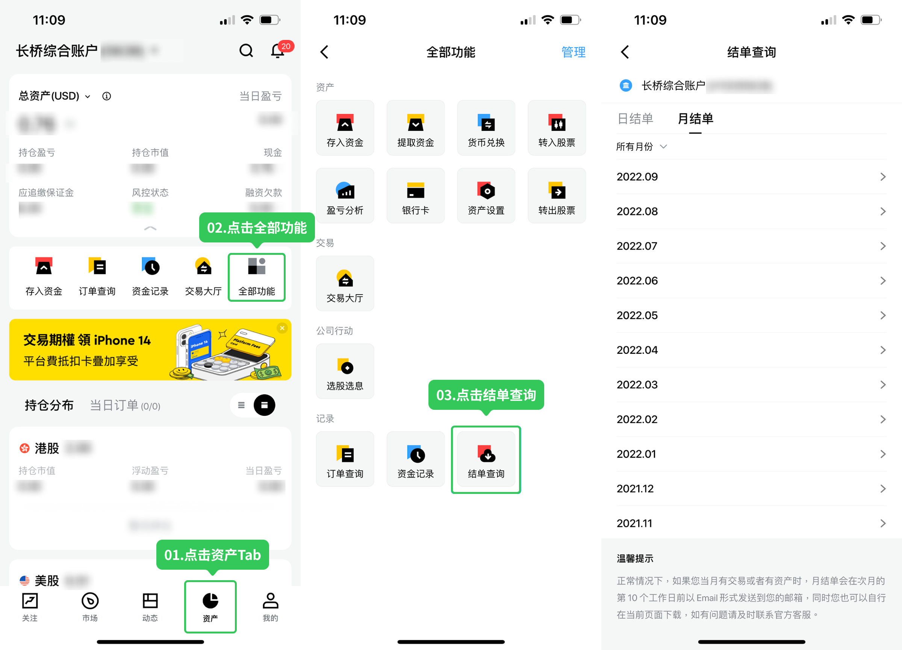

# 结单

长桥证券在交易后定期向客户发送日结单与月结单，可通过 App 或邮箱查看，支持简体中文、繁体中文、英文三种语言版本。

## 发送时间

日结单：产生交易的 2 个交易日内
月结单：下个月的 5 个交易日内

## 结单密码

结单为加密 PDF，密码由手机号末 4 位 + 开户证件号末 4 位组成。如忘记密码请联系客服协助确认。

## 查询途径

途径一：长桥 App > 资产 > 全部功能 > 结单查询，可按日期和类型选择对应结单查看。

途径二：前往开户时填写的邮箱下载查看。如需修改邮箱，可进入长桥 App > 我的 > 设置 > 账号管理 > 邮箱 > 修改邮箱，修改成功后下个结单将发送至新邮箱。

## 结单语言

默认结单语言与长桥 App 语言设置保持一致，支持简体中文、繁体中文、英文。

如需获取其他语言版本，可调整 App 语言设置，修改成功后下个结单生效。

修改路径：长桥 App > 我的 > 设置 > 通用 > 语言设置 > App 语言，保存即可。

如有其他特殊结单需求，请联系客服。

## 字段解释

### 账户总览

展示结单日的日终账户概况，金额统一转化为港币展示。

| 字段名 | 解释 |
|--------|------|
| 资金余额 | 现金余额（或欠款），不含余额通，不含新股或基金申购等预扣的在途资金 |
| 市值 | 证券总价值 + 基金总价值 + 现金总价值 + 余额通总价值 + 当月未结算净利息 + 当月未结算累计分红 |
| 总资产 | 资金余额 + 证券总价值 + 基金总价值 + 余额通总价值 + 当月未结算净利息总价值 |
| 融资金额 | 结单日日终的融资余额 |
| 初始保证金要求 | 建新仓需要的保证金 |
| 维持保证金要求 | 维持持仓需要的保证金 |
| 应追缴保证金 | 结单日日终的应追缴保证金金额 |

### 资金详情

分币种展示结单日的资金变动和日终资金详情。

期末资金余额 = 期初资金余额 + 变更金额
期末资金余额 = 已交收现金 + 待交收现金

| 字段名 | 解释 |
|--------|------|
| 期初资金余额 | 上一账务日日终资金余额 |
| 变更金额 | 结单日的资金变动金额 |
| 期末资金余额 | 结单日日终资金余额 |
| 已交收现金 | 结单日日终已交收的现金汇总 |
| 待交收现金 | 结单日日终未交收的现金汇总 |
| 参考汇率 | 对港币的参考汇率 |
| 参考港币资金余额 | 参考汇率 × 期末资金余额 |

### 投资组合详情

分交易品种、市场、币种展示结单日的持仓变动和日终持仓详情。

期末持仓 = 期初持仓 + 变更数量
持仓市值 = 期末持仓 × 价格（股票和期权取收盘价，基金取净值）

| 字段名 | 解释 |
|--------|------|
| 期初持仓 | 上一账务日日终持仓数量 |
| 变更数量 | 结单日的持仓变动数量 |
| 期末持仓 | 结单日日终持仓数量 |
| 价格 | 结单日前（含结单日）的最新收盘价或净值 |
| 持仓市值 | 期末持仓 × 价格 |
| 维持保证金比例 | 维持持仓需要的保证金比例，无则显示 N/A |
| 维持保证金 | 维持持仓需要的保证金 |
| 成本 | 摊薄成本 |
| 浮动盈亏 | 当前持有仓位的盈亏 |

### 公司行动

展示公司行动股票详情。

| 字段名 | 解释 |
|--------|------|
| 持股截止日 | 执行公司行动的日期 |
| 预计派发 | 预估派送股票或者现金的日期 |
| 股票 | 涉及公司行动的股票 |
| 摘要 | 公司行动摘要信息 |
| 截止股数 | 涉及公司行动的股票持有数量 |
| 预计派发红利股票 | 执行公司行动预计派发股票 |
| 预计派发红利股数 | 执行公司行动预计派发股票数量 |
| 货币 | 执行公司行动预计派发现金币种 |
| 预计派发总额 | 执行公司行动预计派发现金总额 |

### 股票交易明细

分市场、币种展示结单日因股票交易引起的持仓和资金变动，结单日即交易日期。

| 字段名 | 解释 |
|--------|------|
| 交易日期 | 订单实际成交的日期 |
| 交收日期 | 交易所的交收日期 |
| 编号 | 编号 |
| 买/卖 | 交易方向 |
| 项目 | 持仓、资金变动的原因说明（股票编号 + 股票名称） |
| 数量 | 实际成交数量汇总 |
| 平均价格 | 平均价格 = 交易金额 ÷ 数量 |
| 交易金额 | 实际成交金额汇总 |
| 清算金额 | 交易引起的资金变动汇总。卖出 = 交易金额 − 手续费；买入 = −交易金额 − 手续费 |

### 期权交易明细

分市场、币种展示结单日因期权交易引起的持仓和资金变动，结单日 = 交易日期。

| 字段名 | 解释 |
|--------|------|
| 交易日期 | 订单实际成交的日期 |
| 交收日期 | 交易所的交收日期 |
| 编号 | 编号 |
| 买/卖 | 交易方向 |
| 项目 | 持仓、资金变动的原因说明（期权编号 + 期权名称） |
| 数量 | 实际成交数量汇总 |
| 平均价格 | 平均价格 = 交易金额 ÷ 数量 |
| 交易金额 | 实际成交金额汇总 |
| 清算金额 | 交易引起的资金变动汇总。卖出 = 交易金额 − 手续费；买入 = −交易金额 − 手续费 |

### IPO 认购详情

分市场展示因认购资金扣款引起的资金变动，认购资金扣款日期 = 结单日。

| 字段名 | 解释 |
|--------|------|
| 日期 | 正式上报港交所并扣除认购款的日期 |
| 项目 | 持仓、资金变动原因说明（股票编号 + 股票名称） |
| 申购方式 | 新股申购方式 |
| 金额 | 新股认购金额 |
| 数量 | 新股认购数量 |

### 基金交易详情

分基金类型、币种展示基金交易订单，资金和持仓变动同时展示在其他资金变动、其他持仓变动内，确认日期 = 结单日。

| 字段名 | 解释 |
|--------|------|
| 订单日期 | 申请买、卖基金的日期 |
| 确认日期 | 资金、持仓变动日期（资金与持仓交割不在同一日时，取资金交割日期） |
| 编号 | 编号 |
| 项目 | 持仓、资金变动原因说明（基金编号 + 基金名称） |
| 买/卖 | 交易方向 |
| 数量 | 持仓变动数量 |
| 成交价格 | 成交价格 = 金额 ÷ 数量 |
| 金额 | 资金变动金额 |

### 其他资金出入明细

股票交易、期权交易以外的资金变动，发生日期 = 结单日。

| 字段名 | 解释 |
|--------|------|
| 发生日期 | 资金变动日期 |
| 类型 | 资金变动类型 |
| 币种 | 资金变动币种 |
| 金额 | 资金变动金额 |
| 备注 | 备注 |

### 其他持仓出入明细

股票交易、期权交易以外的持仓变动，发生日期 = 结单日。

| 字段名 | 解释 |
|--------|------|
| 发生日期 | 持仓变动日期 |
| 类型 | 持仓变动类型 |
| 数量 | 持仓变动数量 |
| 备注 | 备注 |

### 冻结资金明细

分币种展示冻结资金明细，发生日期 = 结单日。

| 字段名 | 解释 |
|--------|------|
| 发生日期 | 资金冻结的开始日期 |
| 币种 | 冻结资金的币种 |
| 到期日期 | 资金冻结的到期日期 |
| 金额 | 冻结资金对应币种的金额 |
| 备注 | 备注 |

### 冻结持仓明细

分交易品种、市场展示冻结持仓明细，发生日期 = 结单日。

| 字段名 | 解释 |
|--------|------|
| 发生日期 | 持仓冻结的开始日期 |
| 项目 | 持仓编号和持仓名称 |
| 到期日期 | 持仓冻结的到期日期 |
| 数量 | 冻结持仓的数量 |
| 备注 | 备注 |

### 融资利息

截止结单日的当月未扣收融资利息。

| 字段名 | 解释 |
|--------|------|
| 月份 | 所在账单的月份 |
| 货币 | 融资利息的币种 |
| 融资利率 | 结单日融资利率 |
| 当月累计利息（减免金额） | 截止结单日的当月未扣收融资利息，已扣除融资利息减免券减免的金额；括号内展示已减免金额 |

### 证券组合费

截止结单日的当月未扣收证券组合费。

| 字段名 | 解释 |
|--------|------|
| 月份 | 所在账单的月份 |
| 货币 | 证券组合费的币种 |
| 费率 | 结单日证券组合费费率 |
| 当月累计费用 | 截止结单日的当月未扣收证券组合费 |

<!-- backlinks:start -->

## 引用此页面的文档

- [资产与账单](/portfolio-and-statements)

<!-- backlinks:end -->
