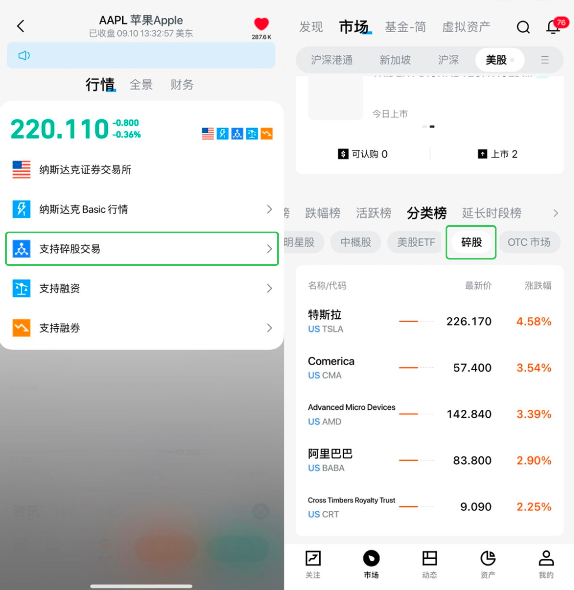
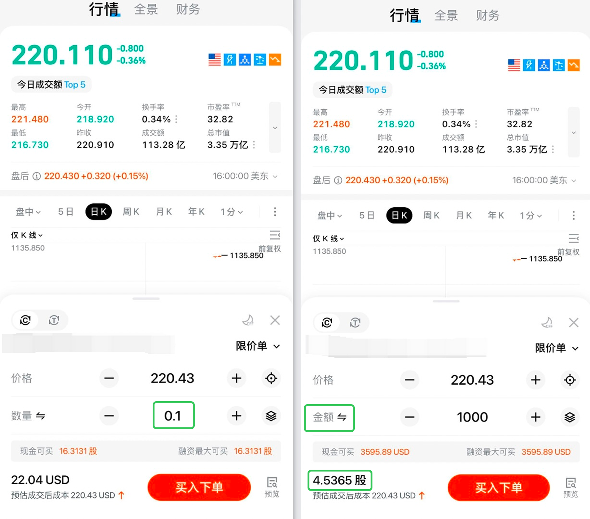

# 碎股单

港股和美股碎股交易定义、交易时间、订单规则、收费及转仓规则。

## 什么是碎股

港股一般以一手为买卖单位，每手股票数量根据股价不同可能为 100 股、500 股、1000 股或 2000 股以上不等。「碎股」指少于完整一手的证券数量。

美股一般以一股为买卖单位，「碎股」指少于 1 股的证券数量（如 0.5 股）。

---

## 港股碎股交易

### 下单方式

长桥 App - 资产 - 交易大厅，选择股票及买卖方向后，在类型中选择「碎股单」，输入价格及数量下单。

### 交易时间

碎股只能在港股持续交易时段交易（交易日 09:30 - 12:00、13:00 - 16:00），不设早市竞价及收市竞价时段。

### 订单规则

- 仅支持「碎股单」订单类型，不设市价单及条件单
- 下单后不能修改订单，但可以撤单
- 碎股及整手股票需分别下单，碎股下单股数必须少于一手数量
- 支持订单有效期：当日有效

### 收费

碎股交易的收费与整手交易收费相同。

### 成交与价格

碎股市场流通量较少，可能因没有匹配到买卖对手而未能成交。买入价格通常比整手高（一般至少相差 5 个价位），建议输入比市价略高的买入价以增加成交机会；卖出同理，价格通常比整手低，建议输入比市价略低的卖出价。

---

## 美股碎股交易

### 支持标的

可通过长桥 App 市场 - 分类榜查找支持碎股交易的标的，个股详情页会展示碎股图标。

### 下单方式

- 直接输入小数数量交易（可接受小数点后 4 位）
- 选择金额交易并输入金额，系统自动根据当前股价转换为对应股份数量

### 交易时间

美股碎股仅支持盘中交易：09:30 - 16:00（美东时间）。半日市为 09:30 - 13:00（美东时间）。

### 订单规则

- 支持限价单及市价单，暂不支持条件单或网格订单
- 暂不支持改单，需先撤单后重新下单
- 碎股交易金额最低 1 美元

### 收费

| 类型 | 佣金 | 平台使用费 |
|------|------|-----------|
| 单笔成交数量 < 1 股 | 免费 | 0.99% × 交易金额，每笔最高 0.99 美元 |
| 单笔成交数量 ≥ 1 股 | 按照美股收费规则正常收取 | |

### 融资与做空

碎股不允许做空。碎股支持统一购买力，融资利率与整股相同。

### 公司行动

支持分红派息、股票拆分等强制类公司行动，不支持供股、邀约等自愿性公司行动。

如遇拆合股，客户可能收到碎股（如某股票 10 合 1，合股前持有 5 股，合股后将收到 0.5 股）。

---

## 碎股转仓

长桥支持碎股转入及转出。详见[股票转仓](/stock-trading/stock-transfer/hk-transfer)。

<!-- backlinks:start -->

## 引用此页面的文档

- [股票交易](/stock-trading)
- [订单类型](/stock-trading/order-types)

<!-- backlinks:end -->
