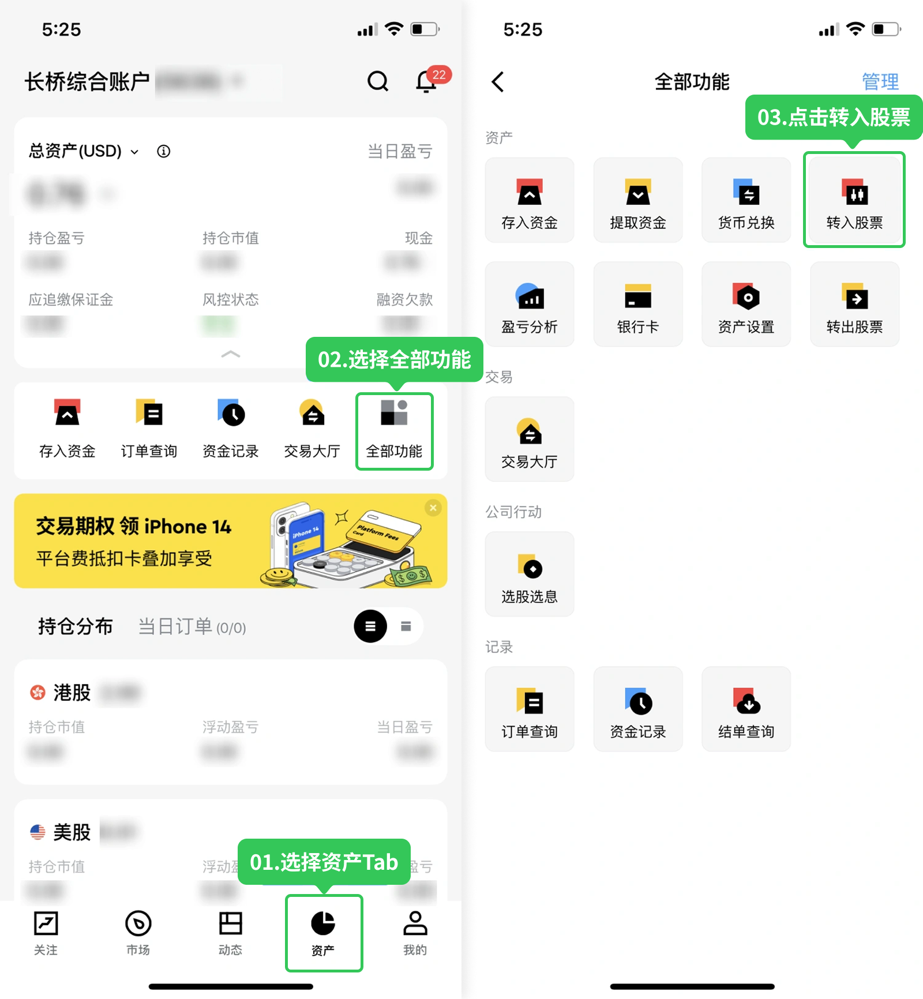
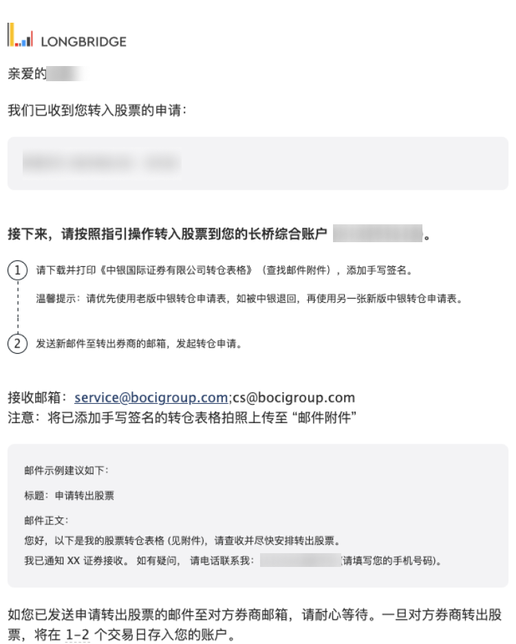
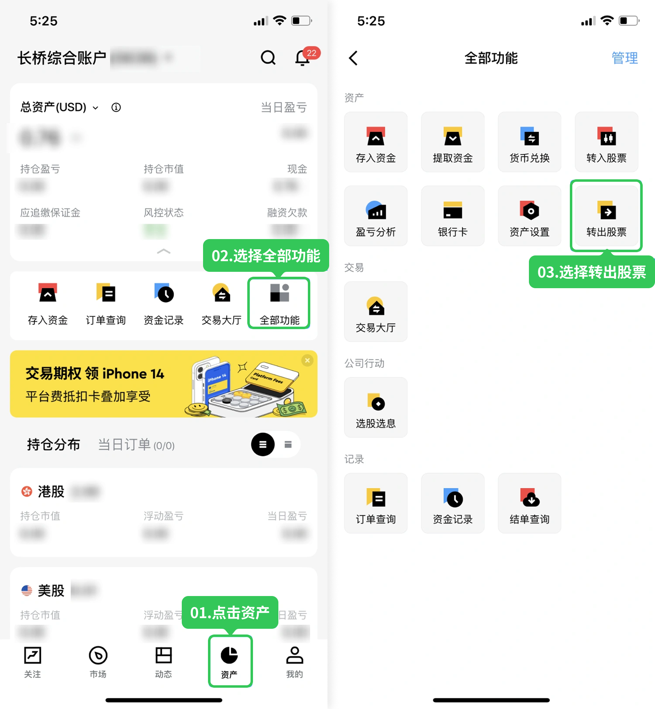
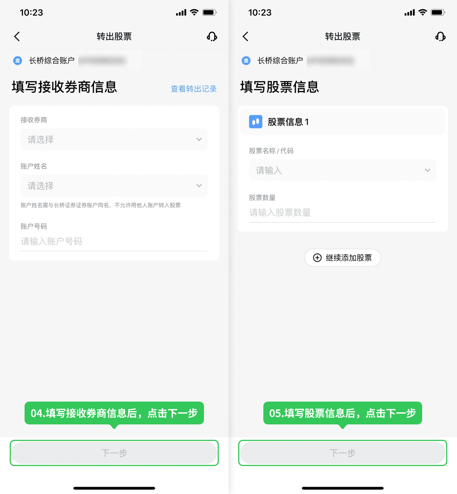
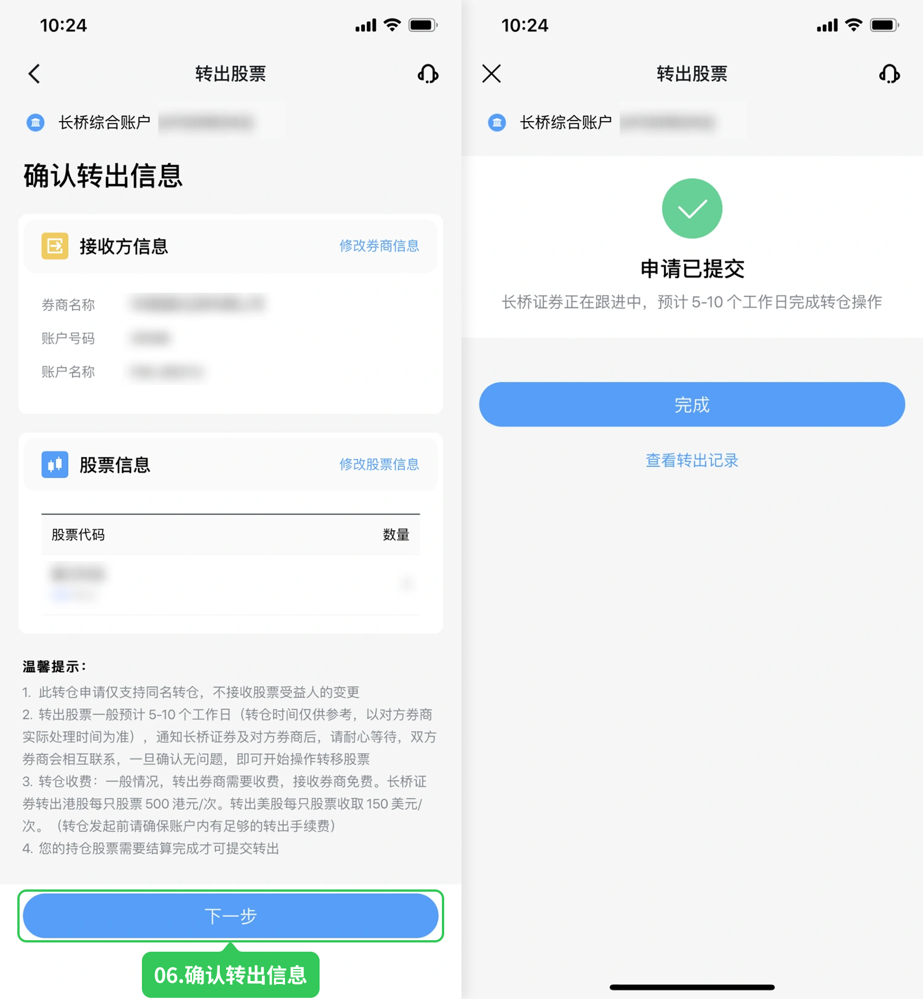

# 股票转仓

将在其他券商持有的股票转移至长桥账户（转入），或从长桥转至其他券商（转出）。仅支持本人同名账户间转仓。

## 支持品类与收费

| 账户 | 支持市场 | 转出收费 |
|------|---------|---------|
| 香港综合账户 | 港股（股票/ETF）、美股（股票/ETF） | 港股 500 HKD/支；美股 150 USD/支 |
| 新加坡综合账户 | 港股（股票/ETF）、美股（股票/ETF）、新加坡股票 | 港股 500 HKD/支；美股 150 USD/支；新加坡股票 100 SGD/支（另加 CDP 手续费，详见下文） |

新加坡账户转出新加坡股票费用明细：

| 转出位置 | 长桥手续费 | CDP 手续费 |
|---------|-----------|-----------|
| 转移到 CDP | 100 SGD / 支 | 10 SGD / 支 |
| 转移到其他经纪公司 / 金融机构 | 100 SGD / 支 | 5 SGD / 支 |

上述费用将由新加坡政府征收 9% 商品及服务税（GST）（如适用）。Central Depository Pte Ltd（CDP）是新加坡交易所（SGX）的全资子公司，负责集中保管新加坡上市公司股票及其他证券。

转入长桥不收费；转出前请确保账户内有足够手续费，转出券商可能另行收费，请与对方确认。

## 处理时间

转入：转仓指示确认后 3–5 个工作日
转出：5–10 个工作日（以双方券商实际处理时间为准）

---

## 香港账户

### 转入股票

**接收方信息（提供给转出券商）：**

港股：
- 接收券商：长桥证券（香港）有限公司 Long Bridge HK Limited
- CCASS 代码：B02195
- 接收账户：您的长桥证券账户号码
- 联系电话：(+852) 3585 8944 / (+852) 3585 8915
- 联系邮箱：settlement@longbridge.hk

美股：
- 接收券商：Long Bridge HK Limited
- DTC 代码：DTC 0534
- 接收账户：您的长桥证券账户号码（H 开头），不要填写 UID
- 联系电话：(+852) 3585 8944 / (+852) 3585 8915
- 联系邮箱：settlement@longbridge.hk

**操作流程：**

1. 长桥 App → 资产 → 存入股票 → 提交转入申请

   

   或进入**资产 → 全部功能 → 转入股票**

   

2. 选择转出券商，填写信息，添加股票代码及数量
3. 确认后提交，转仓指引发送至注册邮箱

   

4. 按邮件下载申请表，打印签名后发至转出券商申请转出
5. 等待双方券商确认后完成转移

**成本价说明：** 每股成本价为选填项。未填写时按转仓成功当日收盘价计算；已填写后无法修改，如有疑问请联系客服。

**多支股票建议合并申请：** 如需从同一券商转入多支股票，建议将所有股票合并到一个申请中提交，而非分开提交多个申请。合并申请可以减少转出方重复收费，同时提升转仓效率。

> 若转出券商对接收账户格式有限制，美股可直接填写 UID（如 U11928885）。

各券商转入长桥的详细操作指引请参考[其他券商转入](/stock-trading/stock-transfer/broker-transfer-guide)。

### 转出股票

**长桥转出方信息（提供给接收券商）：**

港股：
- 转出券商：长桥证券（香港）有限公司 Long Bridge HK Limited
- CCASS 代码：B02195
- 联系电话：(+852) 3585 8944 / (+852) 3585 8915
- 联系邮箱：settlement@longbridge.hk

美股：
- 转出券商：Long Bridge HK Limited
- DTC 代码：DTC 0534
- 联系电话：(+852) 3585 8944 / (+852) 3585 8915
- 联系邮箱：settlement@longbridge.hk

**操作流程：**

1. 长桥 App → 资产 → 全部功能 → 转出股票 → 提交转出申请

   

2. 填写接收券商信息、账户姓名和账户号码

   

3. 填写股票信息，确认后提交

   

4. 申请提交成功后可点击「查看转出记录」查看处理进度

   

**Interactive Brokers（盈透）：** 需在 IB 端提交申请后联系长桥客服提供转仓订单编号（Reference Number）。填写接收账户时请填写长桥 H 开头的证券账号，不要填写 UID。

---

## 新加坡账户

### 转入股票

**接收方信息（提供给转出券商）：**

港股：
- 接收券商：LONG BRIDGE SECURITIES PTE. LTD.
- CCASS ID：B02195
- 联系电话：(+65) 6330 3030
- 联系邮箱：backoffice@longbridge.sg

新加坡股票：
- 接收券商：LONG BRIDGE SECURITIES PTE. LTD.
- DA Code：207
- 联系电话：(+65) 6330 3030
- 联系邮箱：backoffice@longbridge.sg

美股：
- 接收券商：LONG BRIDGE SECURITIES PTE. LTD.
- DTC 代码：DTC 0534
- 联系电话：(+65) 6330 3030
- 联系邮箱：backoffice@longbridge.sg

**操作流程：**

1. 长桥 App → 资产 → 全部功能 → 存入股票 → 提交股票转入申请
2. 填写转出券商、股票代码和转入数量
3. 确认后提交，注册邮箱将收到具体指引
4. 联系转出券商告知转仓，确认后点击「已联系」

**成本价说明：** 与香港账户相同，选填；未填写时按转仓成功当日收盘价计算。

### 转出股票

**长桥转出方信息（提供给接收券商）：**

- 转出券商：LONG BRIDGE SECURITIES PTE. LTD.
- 联系部门：Settlement Department
- 联系电话：(+65) 6330 3030
- 联系邮箱：backoffice@longbridge.sg

**操作流程：**

1. 长桥 App → 资产 → 全部功能 → 转出股票 → 提交股票转出申请
2. 填写接收券商信息和股票信息后提交
3. 通知接收券商通过邮件/电话与长桥确认指示与交割时间
4. 双方券商收到相同指示后完成转仓

**转出 OTC 股票：** App 内不支持，需发送申请至 contact@longbridge.sg，同时向接收券商提交股票转入指令。

**Interactive Brokers（盈透）：** 需在 IB 端提交申请后联系长桥客服提供转仓订单编号。填写接收账户时请填写长桥 SG 开头的证券账号，不要填写 UID。

---

## 通用限制与派息处理

- 仅支持本人同名账户间转仓（新加坡账户仅支持 NCBO，暂不支持变更受益人转仓）
- 只有「待提交」状态的申请才能修改，「执行中」状态需重新提交
- 取消转仓申请需双方券商同时取消
- 持仓股票需结算完成才可提交转出
- 新加坡账户处于融资中或手续费不足时无法发起转出
- 转仓过程中如遇股票派息，长桥收到后会入账至客户长桥账户
- 如无法在 App 内操作，可通过邮件申请：[下载转仓表格](https://pub.lbkrs.com/files/202602/rdnfx1shWbkNDAwD/___20260206.pdf)

<!-- backlinks:start -->

## 引用此页面的文档

- [股票交易](/stock-trading)
- [股票转仓](/stock-trading/stock-transfer)

<!-- backlinks:end -->
