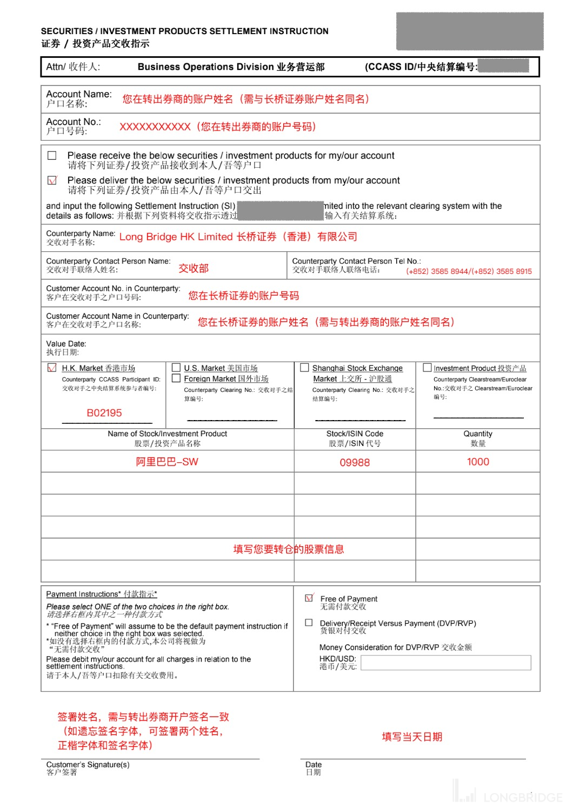
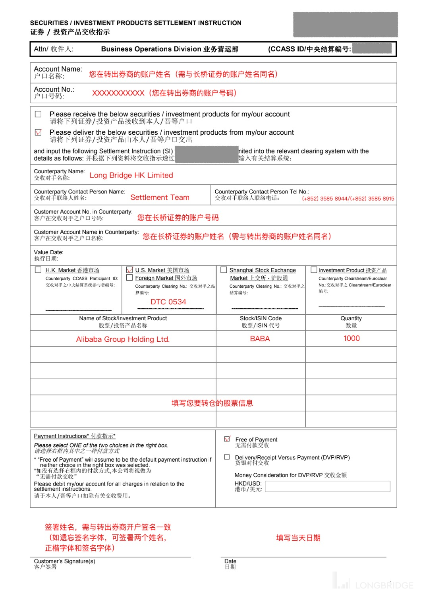

# 从中银国际转仓

从中银国际转入股票分两步：先在长桥提交转入申请，再通知中银国际转出。中银国际**必须手写签名**，不接受电子签名。

> 转入长桥不收费；转出前请确保中银国际账户有足够手续费，否则可能需要先卖出股票或存入资金。

## 第一步：在长桥提交转入申请

1. 打开**长桥 App** → **资产** → **存入股票** → **提交转入申请**；或进入**资产 → 全部功能 → 转入股票**

   

   

2. 填写转出券商信息：

   | 字段 | 填写内容 |
   |------|---------|
   | 转出方 | 中银国际证券有限公司 |
   | 账户号码 | 您在中银国际的 11 位证券账户号码（8 开头、000 结尾，无需填写「-」符号） |
   | 账户姓名 | 您在中银国际的账户姓名（须与长桥账户姓名一致） |

3. 填写转入股票信息（股票代码、数量），确认后提交申请

   > 长桥支持填写每股成本价（选填）。未填写时按转仓成功当日收盘价计算；填写后无法修改，如有疑问请联系客服。

## 第二步：通知中银国际转出股票

1. 至长桥证券开户邮箱接收中银转仓申请表，下载并打印

   > 请优先使用**老版**中银转仓申请表；如被退回，再使用新版表格。

   

2. 在打印好的表格上**手写签名**（须与中银国际开户时签名一致），拍照后以附件形式发邮件至中银国际

   **收件邮箱**：service@bocigroup.com；cs@bocigroup.com

   **邮件标题**：申请转出股票

   **邮件正文**（参考）：
   > 您好，以下是我的股票转仓表格（见附件），请查收并尽快安排转出股票。我已通知长桥证券接收，如有疑问，请电话联系：（您的手机号码）

   如未收到长桥发送的转仓表格，可联系中银国际自行获取，按以下示例填写长桥收方信息：

   **港股转仓表格填写示例**

   

   **美股转仓表格填写示例**

   

3. 建议发出邮件后**电话跟进**，确认中银国际已收到转仓申请并要求尽快处理

   - 联系电话：00852-2718 9666
   - 联系人：clearing operation

完成以上操作后耐心等待，双方券商会跟进处理。转出后预计 **1–2 个工作日**存入长桥账户。

<!-- backlinks:start -->

## 引用此页面的文档

- [其他券商转入](/stock-trading/stock-transfer/broker-transfer-guide)

<!-- backlinks:end -->
