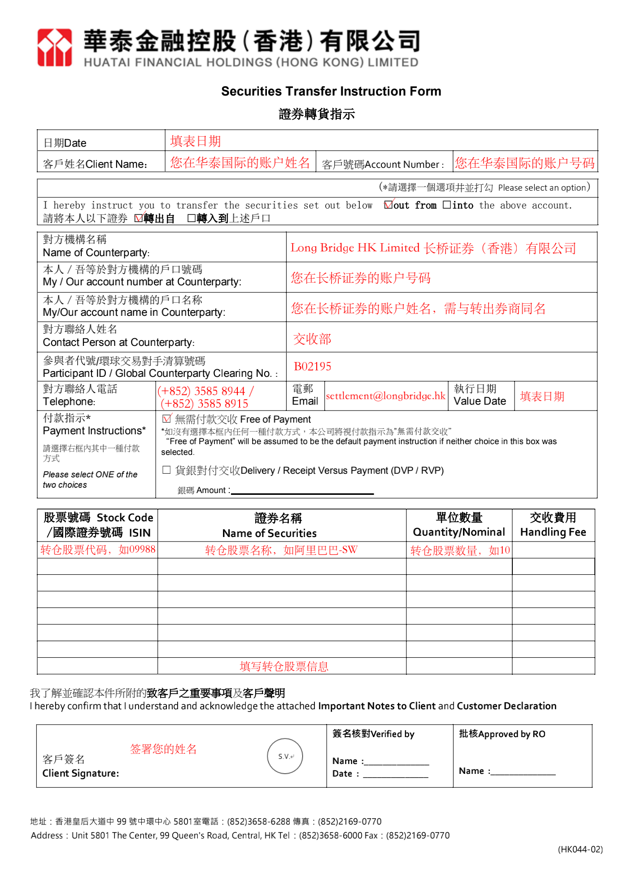
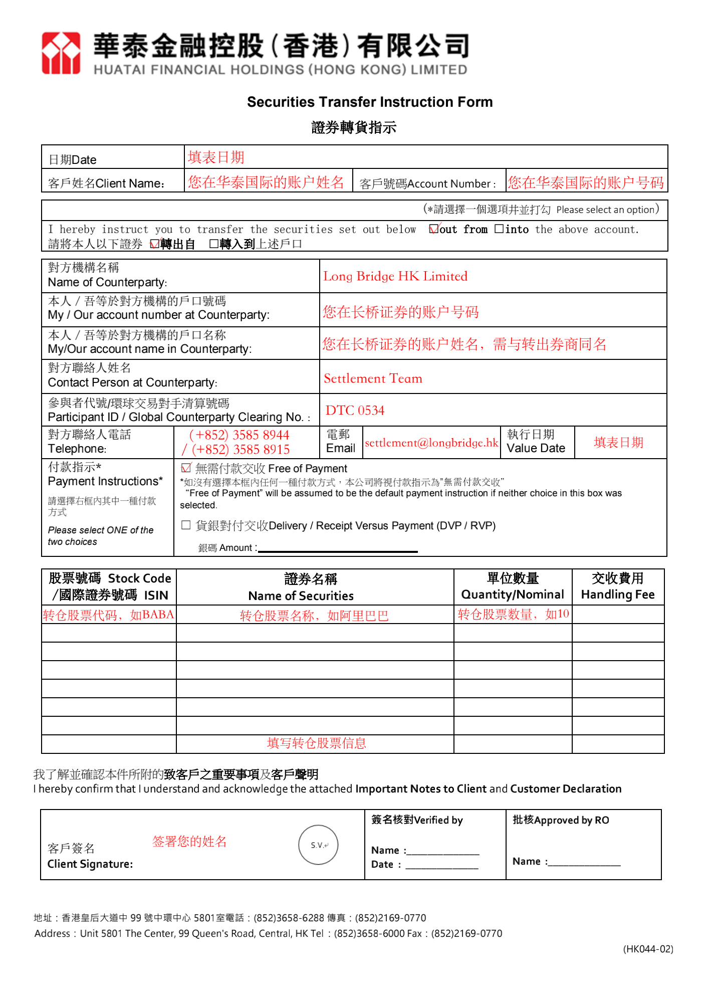

# 从华泰国际转仓

从华泰国际转入股票分两步：先在长桥提交转入申请，再通知华泰国际转出。发送邮件须使用**华泰国际开户时绑定的邮箱**，否则可能不被受理。

> 转入长桥不收费；转出费用由华泰国际收取。

## 第一步：在长桥提交转入申请

1. 打开**长桥 App** → **资产** → **存入股票** → **提交转入申请**；或进入**资产 → 全部功能 → 转入股票**

   

   

2. 填写转出券商信息：

   | 字段 | 填写内容 |
   |------|---------|
   | 转出券商 | 其他证券 |
   | 券商英文名称 | Huatai Financial Holdings (Hong Kong) Limited |
   | CCASS 代码（港股） | B01829 |
   | DTC 代码（美股） | 0534 |
   | 联络人姓名 | 结算部 |
   | Email | settlement@htsc.com |
   | 账户姓名 | 您在华泰国际的账户姓名（须与长桥账户姓名一致） |
   | 账户号码 | 您在华泰国际的账户号码 |

3. 填写转入股票信息（股票代码、数量），确认后提交申请

   > 长桥支持填写每股成本价（选填）。未填写时按转仓成功当日收盘价计算；填写后无法修改，如有疑问请联系客服。

## 第二步：通知华泰国际转出股票

1. 下载并打印华泰国际转仓表格（https://www.htsc.com.hk/files/download/20190313102302702.pdf），按以下接收方信息填写

   **长桥接收方信息（港股）：**

   | 字段 | 内容 |
   |------|------|
   | 接收券商 | 长桥证券（香港）有限公司 Long Bridge HK Limited |
   | CCASS 代码 | B02195 |
   | 联系人 | 交收部 |
   | 联系人电话 | (+852) 3585 8944 / (+852) 3585 8915 |
   | 联系人邮箱 | settlement@longbridge.hk |

   **长桥接收方信息（美股）：**

   | 字段 | 内容 |
   |------|------|
   | 接收券商 | Long Bridge HK Limited |
   | DTC 代码 | DTC 0534 |
   | 联系人 | Settlement Team |
   | 联系人电话 | (+852) 3585 8944 / (+852) 3585 8915 |
   | 联系人邮箱 | settlement@longbridge.hk |

   **港股表格填写示例：**

   

   **美股表格填写示例：**

   

2. 填好表格后拍照，用**华泰国际开户绑定邮箱**发邮件

   **收件人**：settlement@htsc.com；hkinfo@htsc.com

   **主题**：申请转出股票

   **正文**（参考）：
   > 您好，以下是我的股票转仓表格（见附件），请查收并尽快安排转出股票。我已通知长桥证券接收，如有疑问，请电话联系：（您的手机号码）

   **附件**：转仓表格照片

完成后耐心等待，华泰国际转出股票后，将在 **1–2 个工作日**存入长桥账户。

<!-- backlinks:start -->

## 引用此页面的文档

- [其他券商转入](/stock-trading/stock-transfer/broker-transfer-guide)

<!-- backlinks:end -->
