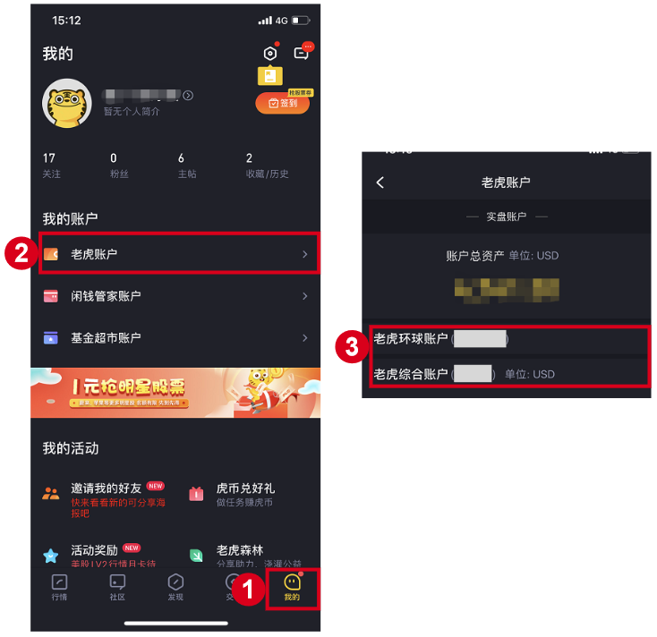
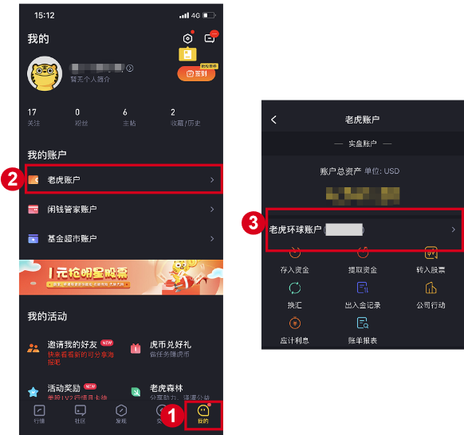
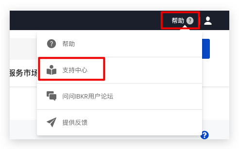
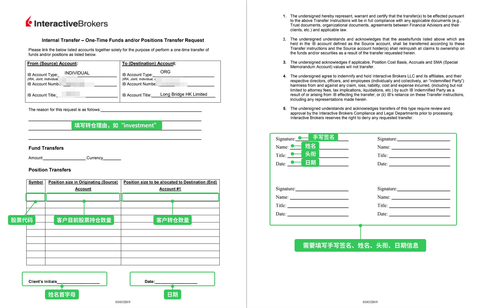

# 从老虎证券转仓

老虎证券有**综合账户**和**环球账户（IB）**两种类型，转仓方式完全不同，请先确认账户类型再操作。

> **重要**：以下指引仅供参考。具体流程请先联系老虎证券客户经理或客服确认，他们会根据您的账户情况提供对应方案。
>
> 转入长桥不收费；转出费用由老虎证券收取。

## 如何确认账户类型

登录老虎证券 → **我的** → **老虎账户**，查看账户类型标识。



---

## 第一步：在长桥提交转入申请（两种账户相同）

1. 打开**长桥 App** → **资产** → **存入股票** → **提交转入申请**；或进入**资产 → 全部功能 → 转入股票**

   

   

2. 转出券商选择**老虎证券**，填写账户姓名和账户号码，填写股票信息后提交

   > 长桥支持填写每股成本价（选填）。未填写时按转仓成功当日收盘价计算；填写后无法修改。

---

## 第二步：通知老虎证券转出

根据账户类型选择对应操作：

---

### 综合账户

联系老虎证券的**电话客服或在线客服**，提交转出股票申请，告知需将指定股票转入长桥证券账户。具体格式以老虎要求为准。

**长桥接收方信息**：CCASS 代码 B02195（港股）/ DTC 0534（美股），联系邮箱 settlement@longbridge.hk。

---

### 环球账户（IB）

环球账户底层为 IB，需登录 IB 官网操作。

#### 获取 IB 登录账号

在老虎 App **我的 → 老虎账户**中，环球账户括号内的账号即为 IB 用户名。



登录 [IB 官网](https://www.interactivebrokers.com.hk/cn/home.php)，使用该账号作为用户名（忘记密码可通过「忘记密码」找回，或致电 IB 客服 021-60868586）。登录后，在投资组合栏查看 IB 账户号（提交长桥转入申请时需要）。

#### 港股（基础 FOP 转账）

路径：**转账与支付** → **转账头寸** → **转出** → **基础 FOP 转账**

填写接收方信息：

| 字段 | 内容 |
|------|------|
| 金融机构 | Long Bridge HK Limited |
| 账户号码 | B02195 + 您的长桥账号（如 B02195+H1234567） |
| 账户名称 | 您的账户姓名（英文） |
| 联系人 | Settlement Team |
| 联系电话 | (+852) 3585 8944 / (+852) 3585 8915 |
| 联系邮箱 | settlement@longbridge.hk |


#### 美股（IB 消息中心）

1. 在 IB 账户右上角选择**帮助** → **支持中心**

   

2. 选择**消息中心**

   

3. **撰写** → **新咨询单** → **Funds & Banking** → **Position Transfers**

   

   

4. 按以下模板填写咨询单后点击 **Preview Ticket**：

   

   ```
   Subject: Transfer US position to another IB broker

   Body:
   Please transfer the following share(s) to U11928885. Detail listed as below:
   A/C Name: Long Bridge HK Limited
   A/C No. U11928885
   Stock Name: [股票名称]
   Symbol: [股票代码].US
   Quantity: [股数]
   Settlement Date: [提交当日 +1 天]
   No change in beneficial owner
   Account: [您的 IB 账户，U 开头]
   ```

   > 结算日期（Settlement Date）建议填写提交当日 +1 天，以便双方及时确认。

5. 提交后 IB 会生成 ticket number，**请将该 ticket number 告知长桥客服**

6. **部分用户**会收到 IB 通知需提供授权书，按实际情况处理后提交

   

如需联系 IB 客服：

| 渠道 | 联系方式 | 服务时间 |
|------|---------|---------|
| IB 上海客服 | +86 (21) 6086 8586 | 周一至周五 09:00–18:00 |
| IB 香港客服 | +852-2156-7907 | 周一至周五 08:00–17:00 |

<!-- backlinks:start -->

## 引用此页面的文档

- [其他券商转入](/stock-trading/stock-transfer/broker-transfer-guide)

<!-- backlinks:end -->
