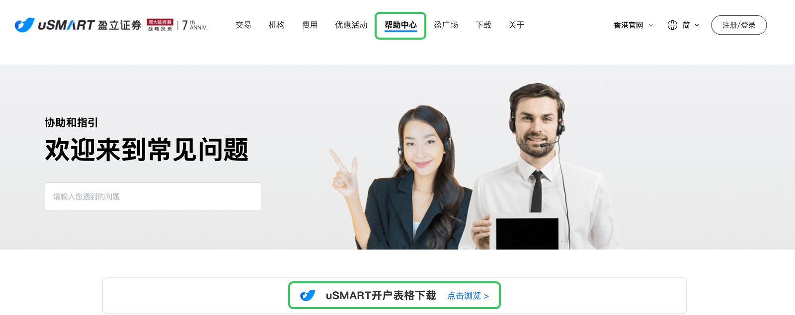
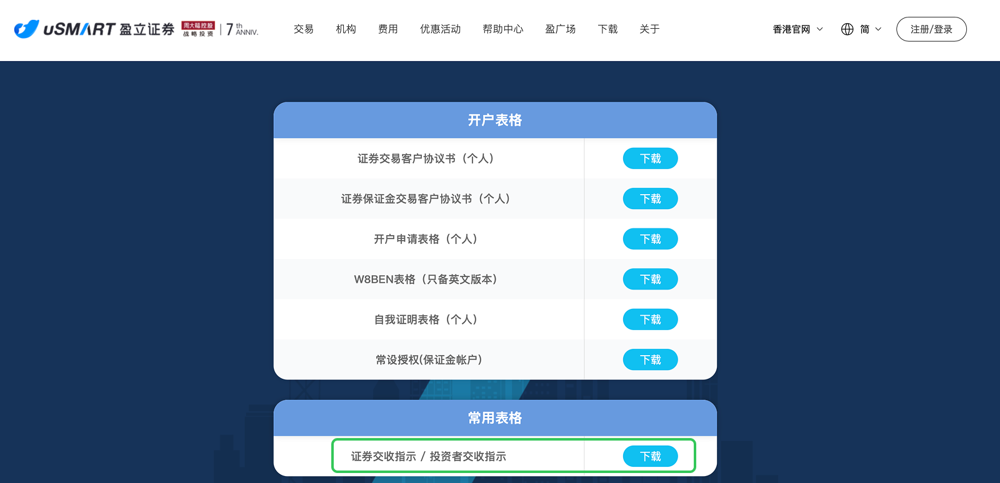
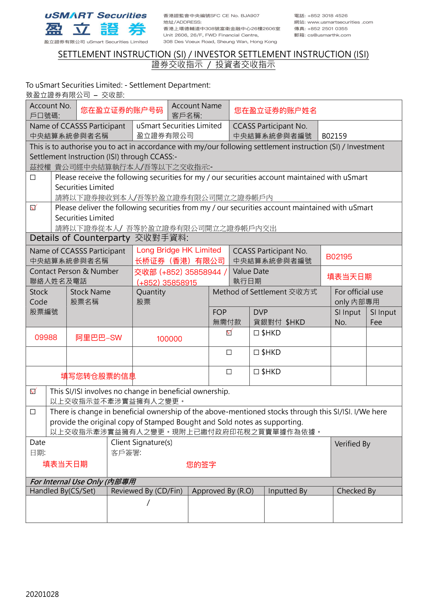
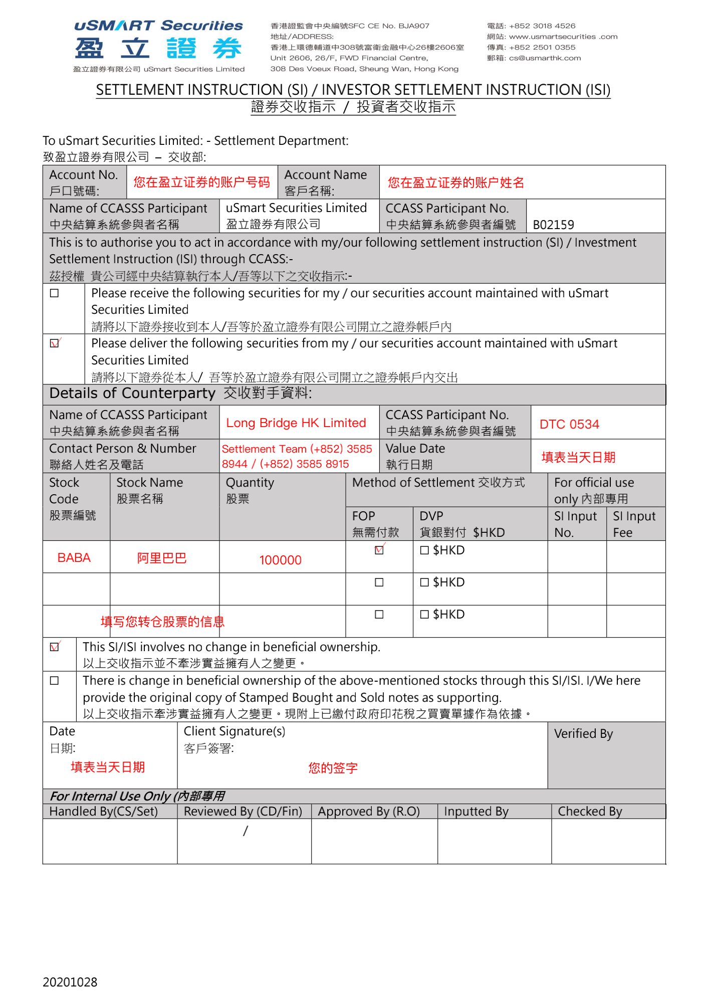

# 从盈立证券转仓

从盈立证券转入股票分两步：先在长桥提交转入申请，再从盈立官网下载表格填写后发给**在线人工客服**。

> **注意**：盈立美股 DTC 代码因账户类型不同：**现金账户为 DTC 3856，保证金账户为 DTC 0534**，填写时请先确认您的账户类型。
>
> 转入长桥不收费；转出费用由盈立证券收取。

## 第一步：在长桥提交转入申请

1. 打开**长桥 App** → **资产** → **存入股票** → **提交转入申请**；或进入**资产 → 全部功能 → 转入股票**

   

   

2. 填写转出券商信息：

   | 字段 | 填写内容 |
   |------|---------|
   | 转出券商 | 其他证券 |
   | 券商英文名称 | uSmart Securities Limited |
   | CCASS 代码（港股） | B02159 |
   | DTC 代码（美股） | 现金账户：DTC 3856；保证金账户：DTC 0534 |
   | 联系人英文姓名 | Settlement Department |
   | 联系人 Email | settlement@usmarthk.com |
   | 账户姓名 | 您在盈立证券的账户姓名（须与长桥账户姓名一致） |
   | 账户号码 | 您在盈立证券的账户号码 |

3. 填写转入股票信息（股票代码、数量），确认后提交申请

   > 长桥支持填写每股成本价（选填）。未填写时按转仓成功当日收盘价计算；填写后无法修改，如有疑问请联系客服。

## 第二步：通知盈立证券转出股票

1. 前往**盈立证券官网**（https://usmart8.com/mainland）→ **帮助中心** → **下载表格**，下载「证券交收指示」表格

   

   

2. 打印表格，按以下长桥接收方信息填写

   **港股接收方信息（长桥）：**

   | 字段 | 内容 |
   |------|------|
   | 接收券商 | 长桥证券（香港）有限公司 Long Bridge HK Limited |
   | CCASS 代码 | B02195 |
   | 联系人 | 交收部 |
   | 联系人电话 | (+852) 3585 8944 / (+852) 3585 8915 |
   | 联系人邮箱 | settlement@longbridge.hk |

   **美股接收方信息（长桥）：**

   | 字段 | 内容 |
   |------|------|
   | 接收券商 | Long Bridge HK Limited |
   | DTC 代码 | DTC 0534 |
   | 联系人 | Settlement Team |
   | 联系人电话 | (+852) 3585 8944 / (+852) 3585 8915 |
   | 联系人邮箱 | settlement@longbridge.hk |

   **港股表格填写示例：**

   

   **美股表格填写示例：**

   

3. 表格填写完毕后拍照，将图片**发给盈立在线客服（人工客服）**，并催促尽快处理转仓

完成后耐心等待，双方券商确认后开始转移，股票转出后将在 **1–2 个工作日**存入长桥账户。

<!-- backlinks:start -->

## 引用此页面的文档

- [其他券商转入](/stock-trading/stock-transfer/broker-transfer-guide)

<!-- backlinks:end -->
