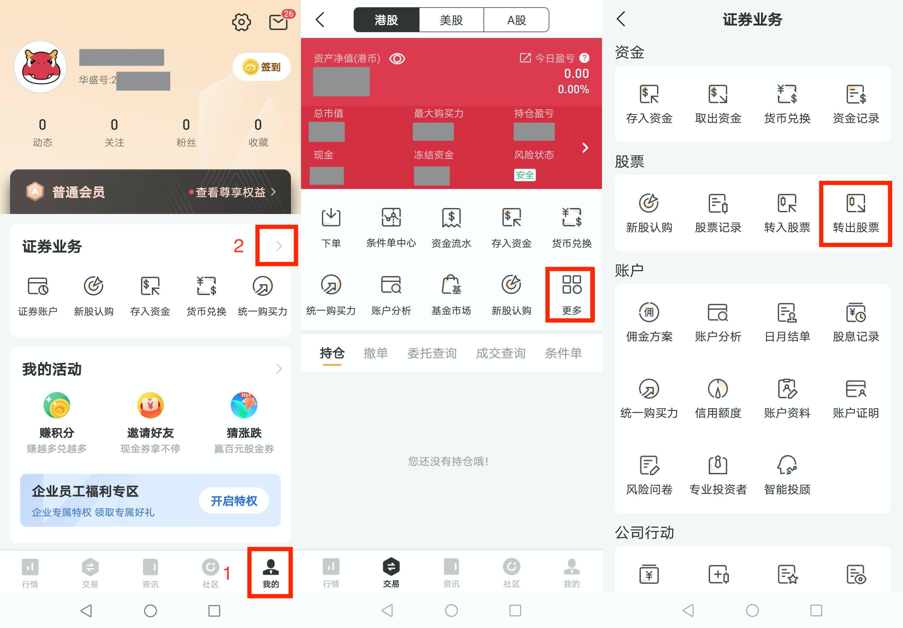
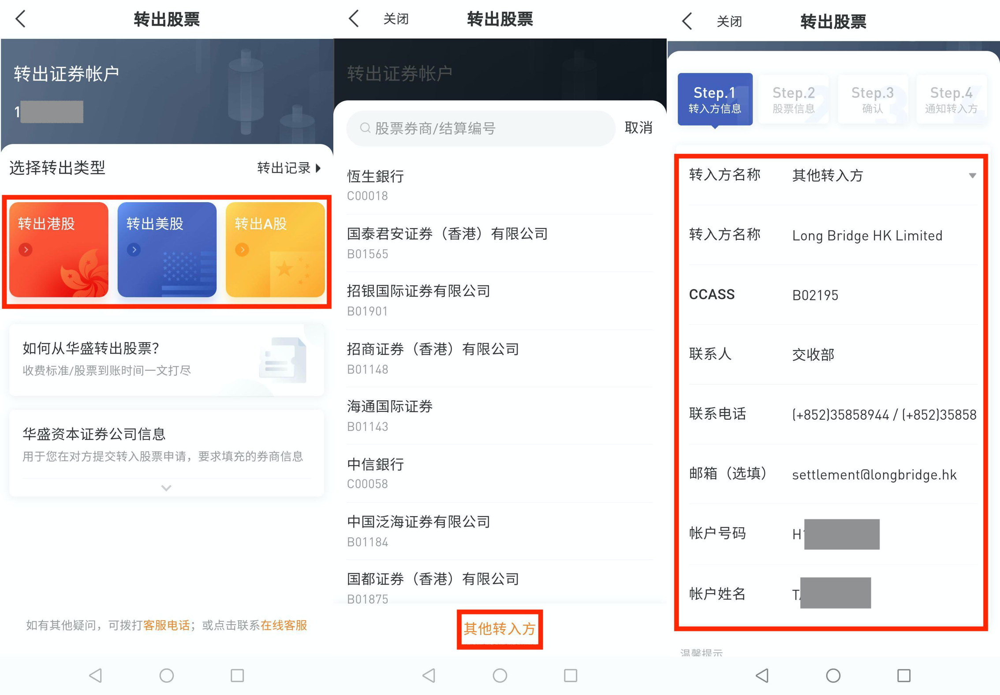

# 从华盛证券转仓

从华盛证券转入股票分两步：先在长桥提交转入申请，再在华盛 App 内直接发起转出。**全程 App 操作，无需发邮件或打印表格。**

> 转入长桥不收费；转出费用由华盛证券收取。

## 第一步：在长桥提交转入申请

1. 打开**长桥 App** → **资产** → **存入股票** → **提交转入申请**；或进入**资产 → 全部功能 → 转入股票**

   

   

2. 填写转出券商信息：

   | 字段 | 填写内容 |
   |------|---------|
   | 转出券商 | 其他证券 |
   | 券商英文名称 | VALUABLE CAPITAL LIMITED |
   | CCASS 代码（港股） | B01904 |
   | DTC 代码（美股） | DTC 0534 |
   | 联络人姓名 | Settlement Team |
   | 电话 | 852-25000333 |
   | Email | enquiry@valuable.com.hk |
   | 账户姓名 | 您在华盛证券的账户姓名（须与长桥账户姓名一致） |
   | 账户号码 | 您在华盛证券的账户号码 |

3. 填写转入股票信息（股票代码、数量），确认后提交申请

   > 长桥支持填写每股成本价（选填）。未填写时按转仓成功当日收盘价计算；填写后无法修改，如有疑问请联系客服。

## 第二步：在华盛 App 发起转出

1. 打开**华盛证券 App** → **我的** → **更多** → **转出股票**

   

2. 选择转出股票对应的市场，接收方选择**其他转入方**，填写长桥接收方信息

   **港股接收方信息（长桥）：**

   | 字段 | 内容 |
   |------|------|
   | 接收券商 | 长桥证券（香港）有限公司 Long Bridge HK Limited |
   | CCASS 代码 | B02195 |
   | 联系人 | 交收部 |
   | 联系人电话 | (+852) 3585 8944 / (+852) 3585 8915 |
   | 联系人邮箱 | settlement@longbridge.hk |
   | 账户号码 | 您的长桥证券账户号码（H 开头） |
   | 账户姓名 | 您的长桥证券账户姓名 |

   **美股接收方信息（长桥）：**

   | 字段 | 内容 |
   |------|------|
   | 接收券商 | Long Bridge HK Limited |
   | DTC 代码 | DTC 0534 |
   | 联系人 | Settlement Team |
   | 联系人电话 | (+852) 3585 8944 / (+852) 3585 8915 |
   | 联系人邮箱 | settlement@longbridge.hk |
   | 账户号码 | 您的长桥证券账户号码（H 开头） |
   | 账户姓名 | 您的长桥证券账户姓名 |

   

3. 填写转出股票代码和股数，点击**下一步**，确认所有信息后提交

完成后耐心等待，华盛转出后股票将在 **1–2 个工作日**存入长桥账户。

<!-- backlinks:start -->

## 引用此页面的文档

- [其他券商转入](/stock-trading/stock-transfer/broker-transfer-guide)

<!-- backlinks:end -->
