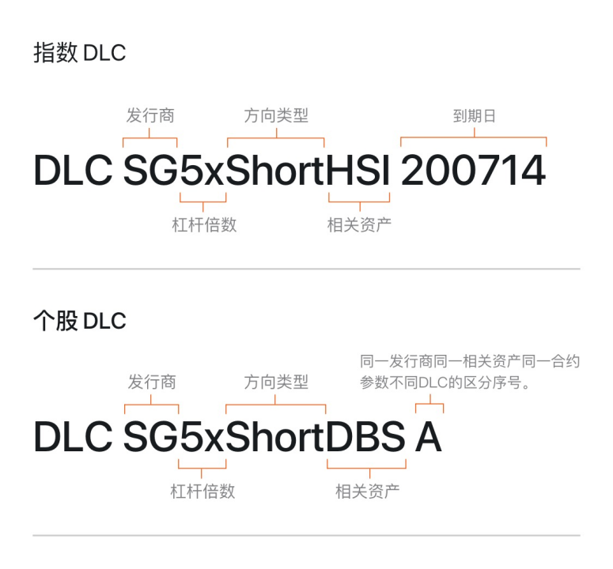

# 新加坡交易规则

新加坡股票市场的交易时段、持续交易规则及 T+2 交收机制说明。

## 交易时间

除公众假期外，新加坡股市一般于星期一至星期五交易。

### 全日交易

| 时段       | 时间            | 交易规则                          |
|----------|---------------|-------------------------------|
| 开市前时段    | 08:30 - 09:00 | 可委托下单，开市前最后一分钟内随机结束，之后为不可撤单时段 |
| 持续交易（早市） | 09:00 - 12:00 | 可委托下单、改单、撤单                   |
| 中午休市     | 12:00 - 13:00 | 休市                            |
| 持续交易（午市） | 13:00 - 17:00 | 可委托下单、改单、撤单                   |
| 收市前时段    | 17:00 - 17:06 | 收市前最后一分钟内随机结束，之后为不可撤单时段       |
| 盘后固定价格交易 | 17:06 - 17:16 | 以收市价撮合                        |

### 半日交易

| 时段       | 时间            | 交易规则          |
|----------|---------------|---------------|
| 开市前时段    | 08:30 - 09:00 | 同全日交易         |
| 持续交易     | 09:00 - 12:00 | 可委托下单、改单、撤单   |
| 收市前时段    | 12:00 - 12:06 | 收市前最后一分钟内随机结束 |
| 盘后固定价格交易 | 12:06 - 12:16 | 以收市价撮合        |

## 交易与交收机制

### 日内交易

日内交易（Day Trade）是指在同一交易日内买入或卖出某只股票头寸，也称 T+0 交易。长桥新加坡账户可进行无限制的日内交易，但须遵守设定的信用额度。

### 结算规则

新交所产品按 T+2 结算，即交易日后第 2 个工作日完成结算。如第二天是公共假期，则顺延至下一个工作日。

### 每手买卖单位

标准交易单位为每手 100 股。部分产品可能以其他交易单位交易：

| 产品           | 每手买卖单位         |
|--------------|----------------|
| 交易所买卖基金（ETF） | 5、10 或 100     |
| 美国存托凭证（ADR）  | 10             |
| 固定收益工具       | 10、100 或 1,000 |

新交所设有碎股交易市场，可以低于 1 手的数量进行碎股交易。

### 最小报价单位

最小报价单位（MBS）也称最小变动价位，指证券价格可以变动的最小幅度。

**股票、房地产投资信托基金（REIT）、商业信托、公司权证**

| 价格范围（SGD）    | 最小报价单位（SGD） | 强制下单范围    |
|--------------|-------------|-----------|
| 0.20 以下      | 0.001       | ±30 个变动价位 |
| 0.20 – 0.995 | 0.005       |           |
| 1.00 及以上     | 0.01        |           |

**结构性认股权证**

| 价格范围（SGD）    | 最小报价单位（SGD） | 强制下单范围    |
|--------------|-------------|-----------|
| 0.20 以下      | 0.001       | ±30 个变动价位 |
| 0.20 – 1.995 | 0.005       |           |
| 2.00 及以上     | 0.01        |           |

**交易所买卖基金和交易所买卖票据**

| 价格范围（SGD） | 最小报价单位（SGD）               | 强制下单范围 |
|-----------|---------------------------|--------|
| 全部        | 0.01 或 0.001（由 SGX-ST 决定） | ±10%   |

**债权证、债券、债权股和优先股**

| 协定价格    | 价格范围（SGD） | 最小报价单位（SGD） | 强制下单范围       |
|---------|-----------|-------------|--------------|
| 1 SGD   | 全部        | 0.001       | ±30 个变动价位    |
| 100 SGD | 全部        | 0.001       | ±1,000 个变动价位 |

**以港元计价的证券**

| 价格范围（HKD）     | 最小报价单位（HKD） |
|---------------|-------------|
| 0.25 以下       | 0.001       |
| 0.25 - 0.495  | 0.005       |
| 0.50 - 9.99   | 0.01        |
| 10.00 - 19.98 | 0.02        |
| 20.00 - 99.95 | 0.05        |
| 100 - 199.90  | 0.1         |
| 200 - 499.80  | 0.2         |
| 500 及以上       | 0.5         |

**以日元计价的证券**

| 价格范围（JPY）       | 最小报价单位（JPY） |
|-----------------|-------------|
| 2,000 以下        | 1           |
| 2,000 - 2,995   | 5           |
| 3,000 - 29,990  | 10          |
| 30,000 - 49,950 | 50          |
| 50,000 - 99,900 | 100         |
| 100,000 及以上     | 1,000       |

## SIPs / CKA / CAR

### 什么是 SIPs

特定投资产品（Specified Investment Products，SIPs）是指比普通股票更复杂的金融产品，包括期货、期权、窝轮、ETF、ETN、杠杆式外汇、CFD
等。

长桥新加坡支持交易的 SIPs 包括：美股期权、港股窝轮、新加坡 DLC（每日杠杆证书）、各市场 ETF。

### 什么是 CKA / CAR

CKA（客户知识评估）和 CAR（客户评价账户）是新加坡金融管理局（MAS）推行的评估机制。投资者必须通过这两项测试才能交易 SIPs 产品。

如未通过 CKA/CAR，下单 SIPs 产品时系统会提示完成测评，通过后方可交易。

## DLC 每日杠杆证书

DLC（Daily Leverage Certificates）是一种金融衍生品，为投资者提供标的资产（如市场指数或个股）每日表现最高 7 倍的固定杠杆。

基本原则：如标的资产较前一交易日收盘价波动 1%，3 倍 DLC 的价值将波动 3%，7 倍 DLC 的价值将波动 7%。

### DLC 名称构成

### 投资者适宜性

适合投资 DLC 的投资者须愿意承担在短时间内**可能亏损全部投资本金**
的风险，并应充分了解产品，具备适当评价和评估产品结构、相关风险、估值、成本和预期回报的较高知识水平或充足交易经验。

DLC 旨在获取与标的资产每日上涨表现相应的短期投资回报，本质上比其特征更复杂，只适合对复杂产品具有投资知识且有高风险承受能力的投资者。所有投资者均需具备
SIP 交易资格才能投资 DLC。

投资者在作出任何投资决定之前，应先到新加坡交易所官网阅读有关的 DLC 上市文件。

更多信息请参考新加坡交易所官网：[https://www2.sgx.com](https://www2.sgx.com)（路径：证券 - 产品 - DLC，右上角可切换中英文）

## 相关文档

- [限价单与市价单](/stock-trading/订单类型/限价单与市价单) — 订单类型

<!-- backlinks:start -->

## 引用此页面的文档

- [股票交易](/stock-trading)
- [交易市场与规则](/stock-trading/trading-hours-and-rules)

<!-- backlinks:end -->
