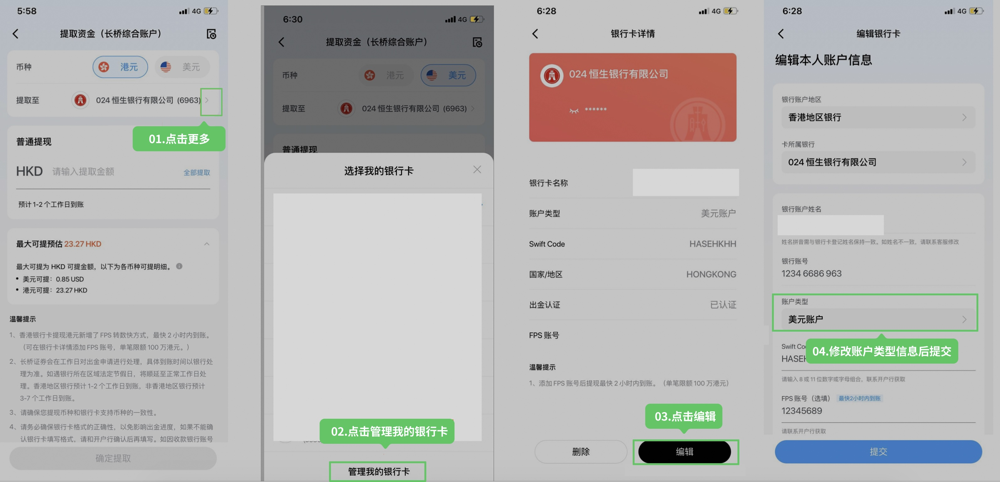
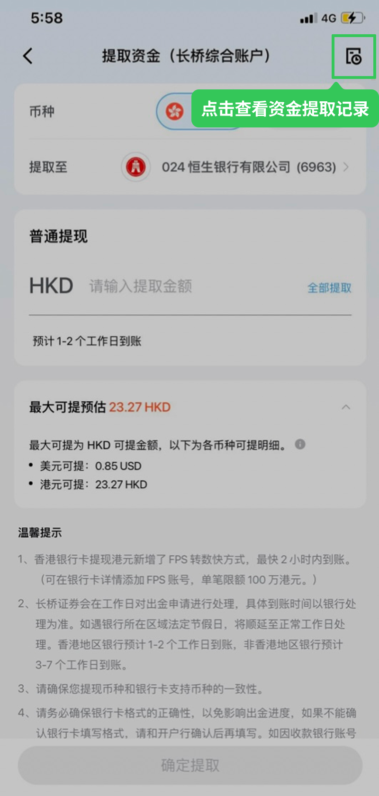

# 银行卡出金

系统会根据银行卡类型自动匹配出金方式：港币默认使用 FPS 转数快，美元使用网银转账，民生银行使用银证转账。

费率和限额说明见 [网银出金](/withdrawal/hk-online-banking)。

## 操作步骤

1. 确认可提取的币种和金额（提取资金页会显示最大可提金额，仅为当前币种，不含其他币种）
2. 确认银行卡账户类型与提取币种匹配：港元需港元账户或综合账户，美元需美元账户或综合账户

   如银行卡账户类型填写错误，可直接修改：

   

3. 确认银行卡已完成认证（未完成入金见证的银行卡需先入金认证）
4. 打开长桥 App，进入 **资产 → 全部功能 → 提取资金**，选择币种和收款银行卡，提交申请
5. 在**提取资金 → 右上角提取记录**查看进度

   

## 开通余额通时的出金

如已开通余额通，提取金额会分为「现金可提」和「最大可提」：
- 如提取金额在「现金可提」范围内，按正常时效出金
- 如提取金额超过「现金可提」（包含余额通资金），系统自动赎回对应余额通基金（赎回需 2 个交易日），赎回到账后自动出金

也可先在余额通基金页面手动申请赎回，待赎回成功后再单独出金。

## 出金失败时

在**提取资金 → 右上角提取记录**中点击该条记录查看失败原因。如银行卡信息填写错误，在**资产 → 银行卡**中修改后重新提交出金申请。

## 出金申请被审查

长桥依据反洗钱及恐怖分子资金筹集相关法规，可能对部分出金申请进行审查，包括设定短暂的提款限制期。如收到审查通知，出金申请需等待一定时间处理，这是保障资金安全及维护金融体系稳定的必要措施。

## 相关文档

- [网银出金](/withdrawal/hk-online-banking) — 出金规则与费用详情
- [银行卡绑定与审核](/deposit/银行卡绑定与审核) — 银行卡绑定与认证要求

<!-- backlinks:start -->

## 引用此页面的文档

- [网银出金](/withdrawal/hk-online-banking)
- [出金](/withdrawal)

<!-- backlinks:end -->
